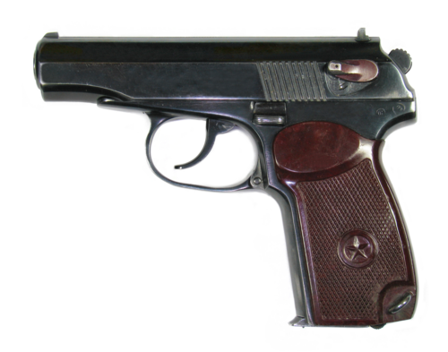

# Pistolet Makarowa PM
### Makarov PM Pistol | ПМ (Пистолет Макарова)

---

## Opis

PM (Пистолет Макарова — Pistolet Makarowa) to radziecki pistolet samopowtarzalny kalibru 9×18 mm Makarov zaprojektowany przez Nikołaja Makarowa i przyjęty do służby w 1951 roku jako zastępnik Pistoletu TT. Jest jednym z najszerzej produkowanych pistoletów w historii — szacuje się ponad 5 milionów egzemplarzy. Prosta, niezawodna i tania w produkcji konstrukcja z podwójnym działaniem spustu (DA/SA) sprawiła, że PM stał się standardowym pistoletem wojskowym i policyjnym ZSRR, a następnie wszystkich krajów Układu Warszawskiego — w tym Polski. Mimo oficjalnego zastąpienia przez MP-443 Grach, PM jest nadal powszechnie używany w rosyjskiej policji, służbach i wojskach rezerwowych.

## Dane techniczne

| Parametr | Wartość |
|----------|---------|
| Typ | Pistolet samopowtarzalny |
| Kraj produkcji | ZSRR / Rosja |
| Rok wprowadzenia | 1951 |
| Kaliber | 9×18 mm Makarov |
| Długość | 161 mm |
| Długość lufy | 93 mm |
| Masa (bez magazynka) | 730 g |
| Pojemność magazynka | 8 nabojów |
| Prędkość wylotowa | 315 m/s |
| Skuteczny zasięg | 50 m |

## Charakterystyczne cechy rozpoznawcze

> Jak odróżnić PM od TT, MP-443 i pistoletów zachodnich:

- **Mała, kompaktowa sylwetka — wyraźnie mniejszy od MP-443 i TT:** PM jest wyraźnie mniejszy i lżejszy od nowszego MP-443 Grach; przy porównaniu proporcje są "minipistoletu"; mniejszy też od TT (który jest większy i bardziej kanciast)
- **Charakterystyczna okrągła "pętla" spustu i estetyka lat 50.:** PM ma charakterystyczny zaokrąglony spust w prostokątnej kabłąkowej ramie; ogólna estetyka jest zaokrąglona i "miękka" — typowa dla projektów lat 50.; MP-443 jest kanciasty i nowoczesny
- **Zewnętrzny kurek (hammer) z tyłu slajdu:** PM ma wyraźny zewnętrzny kurek z tyłu zamka (slide); naciąganie PM jest widoczne; pistolety bez widocznego kurka (jak Glock) wyglądają inaczej
- **Mały, prosty celownik bez podświetlenia:** PM ma minimalistyczny stały celownik bez żadnych nacięć białych punktów, bez podświetlenia; nowoczesne pistolety mają rozbudowane systemy celownicze
- **Magazynek 8-nabojowy — wyraźnie węższy niż MP-443 (17 nabojów):** magazynek PM jest wąski (8 nabojów jednorzędowych); magazynek MP-443 jest szerszy (17 nabojów dwurzędowych); różnica szerokości chwytu jest widoczna
- **Brak szyny Picatinny — gładka rama pod lufą:** PM nie ma szyny do latarki czy celownika laserowego; gładki dół ramy to cecha "starego" pistoletu; MP-443 i nowsze pistolety mają szynę

## Ciekawostka

> PM przez długie lata był "pistoletem wrogów i przyjaciół" jednocześnie — każdy kraj NATO miał w swoich arsenałach zdobyczne PM, bo były tak powszechne, że trafiały do wszystkich. Izraelskie służby bezpieczeństwa używały zdobycznych PM przez dekady. CIA miała zapasy PM "do operacji pod fałszywą flagą". Paradoksalnie, PM jest tak prosty, że produkuje go dziś wiele firm komercyjnych dla kolekcjonerów zachodnich — czyniąc z radzieckiego pistoletu wojskowego popularny eksponat w prywatnych kolekcjach USA.

