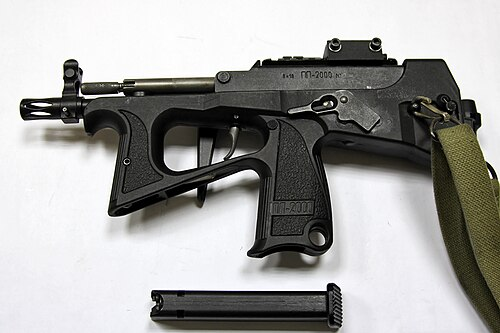

# Pistolet maszynowy PP-2000
### PP-2000 Submachine Gun | ПП-2000

---

## Opis

PP-2000 to rosyjski pistolet maszynowy kalibru 9×19 mm Parabellum opracowany przez KBP w Tule i przyjęty do służby w 2006 roku dla FSB, policji i sił specjalnych. Wyróżnia się wyjątkową kompaktowością przy kalibru 9×19 mm — mniejszy od PP-91 Kedr przy używaniu mocniejszego naboju NATO. Może używać standardowych magazynków 9×19 mm i specjalnych nabojów API z rdzeniem wolframowym (7N31) do penetracji kamizelek IIIA. Kolba ze złożonego magazynka 44-nabojowego (tylna kolba z dodatkowym magazynkiem) jest unikalną cechą. Stosowany przez policję kryminalną, FSB i ochronę VIP; pojawił się na Ukrainie.

## Dane techniczne

| Parametr | Wartość |
|----------|---------|
| Typ | Pistolet maszynowy |
| Kraj produkcji | Rosja |
| Rok wprowadzenia | 2006 |
| Kaliber | 9×19 mm Parabellum |
| Długość (bez kolby) | 340 mm |
| Długość (z kolbą/mag. 44 nab.) | 582 mm |
| Długość lufy | 179 mm |
| Masa (bez magazynka) | 1 400 g |
| Pojemność magazynka | 20 lub 44 nabojów |
| Szybkostrzelność | 600–800 strz./min |
| Skuteczny zasięg | 100 m |

## Charakterystyczne cechy rozpoznawcze

> Jak odróżnić PP-2000 od PP-91 Kedr i pistoletów maszynowych zachodnich:

- **Unikalny "tylny magazynek" jako kolba:** PP-2000 może mieć jako "kolbę" dodatkowy magazynek 44-nabojowy wtykany z tyłu broni — charakterystyczny widok "dużego magazynka z tyłu" jest unikalny wśród pistoletów maszynowych; żadna inna broń nie używa magazynka jako kolby w ten sposób
- **Bardzo kompaktowa i ergonomiczna bryła — "krótki i płaski":** PP-2000 bez kolby jest krótki (340 mm) i relatywnie płaski; wygląda bardzo kompaktowo i nowocześnie w porównaniu do bardziej "pudełkowego" Kedr
- **Nowoczesna czarna polimerowa rama — taktyczny wygląd:** PP-2000 ma nowoczesną polimerową ramę z szynami do akcesorium; wygląda jak nowoczesna zachodnia broń specjalna; PP-91 Kedr wygląda starszej generacji
- **Szyna Picatinny na górze — możliwość montażu kolimatorów:** PP-2000 ma szynę na górze komory zamkowej do montażu celowników; Kedr i APS tej szyny nie mają; nowoczesna szyna to cecha "XXI-wiecznej" broni
- **Wyraźna dźwignia selektora ognia po lewej stronie:** PP-2000 ma selektor ognia (semi/auto/bezpiecznik) widoczny po lewej; wygląd nowocześ­niejszy od starszych dźwigni APS
- **Broń "policyjno-FSB" — rzadko widoczna u regularnego wojska:** PP-2000 pojawia się u FSB i policji kryminalnej; nie jest standardową bronią piechoty; kontekst użycia jest identyfikatorem

## Ciekawostka

> PP-2000 jest jedyną bronią na świecie, która używa dodatkowego magazynka jako kolby — i to nie jako trick marketingowy, ale jako przemyślane rozwiązanie taktyczne. Gdy strzelec strzela z magazynka 20-nabojowego, ma z tyłu gotowy do załadowania magazynek 44-nabojowy; po opróżnieniu zamieniane strony — co daje łącznie 64 naboje w czasie krótszym niż przeładowanie standardowe. Pomysł jest chwytliwy, ale ma wadę: magazynek-kolba jest kruchy i może pęknąć przy upadku; stąd PP-2000 jest popularny wśród ochroniarzy VIP w samochodach (gdzie upadki są rzadkie), a mniej wśród żołnierzy w polu.

