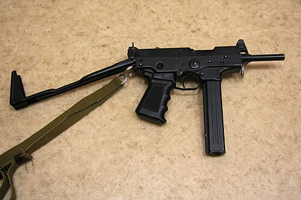

# Pistolet maszynowy PP-91 Kedr
### PP-91 Kedr Submachine Gun | ПП-91 «Кедр»

---

## Opis

PP-91 Kedr (Кедр — Cedr syberyjski) to rosyjski pistolet maszynowy kalibru 9×18 mm Makarov opracowany przez Jewgienija Dragonowa (syna konstruktora SVD) i przyjęty do służby w 1994 roku dla policji i sił specjalnych. Jest bardzo kompaktową bronią — z kolbą złożoną mieści się w kieszeni lub plecaku; przeznaczona dla ochroniarzy, policjantów w terenie zabudowanym i obsługi pojazdów. Szybkostrzelność 1000 strz./min i magazynek 20–30 nabojów dają dużą gęstość ognia na bliskich odległościach (do 50 m). Kedr jest popularny wśród rosyjskich policjantów i prywatnych firm ochrony. Wersja z tłumikiem to PP-91-01 Kedr-B.

## Dane techniczne

| Parametr | Wartość |
|----------|---------|
| Typ | Pistolet maszynowy (SMG) |
| Kraj produkcji | Rosja |
| Rok wprowadzenia | 1994 |
| Kaliber | 9×18 mm Makarov |
| Długość (kolba złożona) | 305 mm |
| Długość (kolba rozłożona) | 530 mm |
| Długość lufy | 120 mm |
| Masa (bez magazynka) | 1 540 g |
| Pojemność magazynka | 20 lub 30 nabojów |
| Szybkostrzelność | 1 000 strz./min |
| Skuteczny zasięg | 50 m |

## Charakterystyczne cechy rozpoznawcze

> Jak odróżnić PP-91 Kedr od PM i APS:

- **Wyraźnie "pistolet maszynowy" — dłuższy od pistoletu, krótszy od karabinu:** Kedr ma wyraźny "pośredni" rozmiar między pistoletem a karabinem szturmowym; z kolbą rozłożoną ma 530 mm — jak AKS-74U; z kolbą złożoną — 305 mm, jak duży pistolet
- **Metalowa składana kolba szkieletowa — charakterystyczna "kratownica":** Kedr ma typową składaną metalową kolbę szkieletową (drucianą kratownicę) jak wiele pistolety maszynowych z lat 90.; w złożeniu leży wzdłuż prawej strony broni
- **Duży magazynek 20–30 nabojów sterczący z dołu chwytu:** magazynek Kedr jest wyraźnie dłuższy od magazynka PM; sterczy dość daleko poniżej chwytu; widoczna przy pierwszym spojrzeniu "długa skrzynka" pod pistoletem
- **Szybkostrzelność 1000 strz./min — seria brzmi inaczej niż AK:** Kedr strzela wyraźnie szybciej niż AK-74 (600 strz./min); przy oglądaniu serii na nagraniu rhythmiczny dźwięk jest wyraźnie szybszy
- **Brak lufy wystającej z łoża — lufa jest wewnątrz:** lufa Kedr jest ukryta w łożu prawie do wylotu; proporcje są "kompaktowe" — brak długiej lufy odstającej jak w karabinach szturmowych
- **Stosowany przez policję w cywilnym otoczeniu — widoczny na zdjęciach funkcjonariuszy:** Kedr pojawia się głównie u rosyjskich policjantów, strażników i ochroniarzy; nie jest typową bronią wojskową; ten kontekst jest identyfikatorem

## Ciekawostka

> PP-91 Kedr zyskał sławę po tym, jak stał się standardowym uzbrojeniem rosyjskich ochroniarzy VIP i policji ochrony osobistej w burzliwych latach 90. W epoce rosyjskich "wojen gangsterskich" (1991–2000) firma ochroniarska z Kedrem była symbolem "poważnej ochrony". Sam Kedr był projektowany z myślą o tym właśnie zastosowaniu — kompaktowy, silny ogień w wąskich korytarzach i windach. Paradoksalnie, wersja cywilna (semi-auto) sprzedawana była jako broń samoobronowa dla prywatnych obywateli — jeden z nielicznych przypadków, gdy broń wojskowa trafiła na rynek cywilny w Rosji.

