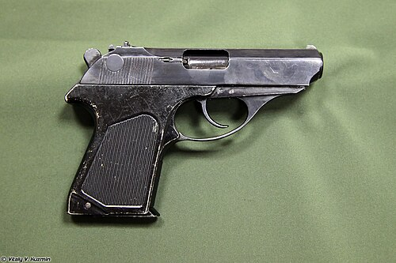

# Pistolet PSM
### PSM Pistol | ПСМ (Пистолет Самозарядный Малогабаритный)

---

## Opis

PSM (Пистолет Самозарядный Малогабаритный — Pistolet Samopowtarzalny Małogabarytowy) to radziecki ultrakompaktowy pistolet kalibru 5,45×18 mm MPts opracowany przez TsNIITochMash i przyjęty do służby w 1972 roku dla KGB, oficerów wywiadu i oficerów sztabowych wymagających dyskretnej broni osobistej. Charakteryzuje się wyjątkową płaskością — PSM ma zaledwie 17 mm grubości, co pozwala na noszenie pod marynarką bez widocznej sylwetki. Nabój 5,45×18 mm ma wysoki współczynnik penetracji — przebija kamizelki balistyczne klasy I oraz szyby samochodowe; pocisk jest bardzo lekki i szybki. PSM jest do dziś symbolem "pistoletu szpiega" — noszonego przez sowieckich i rosyjskich agentów wywiadu.

## Dane techniczne

| Parametr | Wartość |
|----------|---------|
| Typ | Ultrakompaktowy pistolet samopowtarzalny |
| Kraj produkcji | ZSRR / Rosja |
| Rok wprowadzenia | 1972 |
| Kaliber | 5,45×18 mm MPts |
| Długość | 155 mm |
| Szerokość | 17 mm |
| Długość lufy | 85 mm |
| Masa (bez magazynka) | 460 g |
| Pojemność magazynka | 8 nabojów |
| Prędkość wylotowa | 315 m/s |
| Skuteczny zasięg | 25 m |

## Charakterystyczne cechy rozpoznawcze

> Jak odróżnić PSM od PM i innych pistoletów kompaktowych:

- **Wyjątkowo płaski profil — tylko 17 mm grubości:** PSM jest niemal dwukrotnie cieńszy od PM (17 mm vs ~30 mm); przy oglądaniu od przodu PSM wygląda jak "kartka" w porównaniu do PM; ta płaskość jest ikoniczną cechą wizualną PSM
- **Mały kaliber — cienka lufa, mały otwór wylotowy:** lufa PSM w kalibrze 5,45 mm ma wyraźnie mniejszą średnicę otworu niż lufa PM (9 mm); przy bliskim oglądaniu lub na fotografii zbliżeniowej wyraźna różnica w kalibrze
- **Prostokątny, "tabliczkowy" kształt — bez żadnych zaokrągleń:** PSM ma charakterystyczny bardzo prostokątny, "płaski tabliczkowy" kształt bez wyraźnych krzywizn; PM jest zaokrąglony; PSM wygląda geometrycznie jak "prostokąt z lufą"
- **Minimalistyczne przyrządy celownicze — prawie bez celownika:** PSM ma bardzo małe, prawie niewidoczne przyrządy celownicze; to broń na bliski dystans (25 m), gdzie celownik nie jest krytyczny; przy oglądaniu z góry widać mikroskopijny celownik i muszkę
- **Brak zewnętrznego kurka (hammer-less lub internal):** PSM nie ma widocznego zewnętrznego kurka; profil tylnej części zamka jest gładki — co dodatkowo zmniejsza grubość i zapobiega zaczepieniu przy dobywaniu; PM ma wyraźny kurek z tyłu
- **Bardzo lekki — 460 g — "prawie nieważki":** PSM waży 460 g bez magazynka; PM waży 730 g; różnica masy jest wyczuwalna przy trzymaniu; PSM "znika" w kieszeni marynarki

## Ciekawostka

> PSM był przez lata pistoletem, którego zachodni agenci wywiadu bali się najbardziej — nie ze względu na siłę, ale na przenikliwość naboju 5,45×18 mm. CIA odkryła, że PSM przebija ówczesne kamizelki kevlarowe klasy I, które chroniły przed nabojami pistoletowymi. Przez lata 70.–80. agenci chronieni przez CIA i FBI nosili kamizelki nieprzebijalne przez pistolety — ale niechroniące przed PSM. Sowieccy oficerowie wywiadu nosili PSM właśnie po to, by mieć "przewagę przenikania" nad potencjalnymi zachodnimi ochroniarzami.

