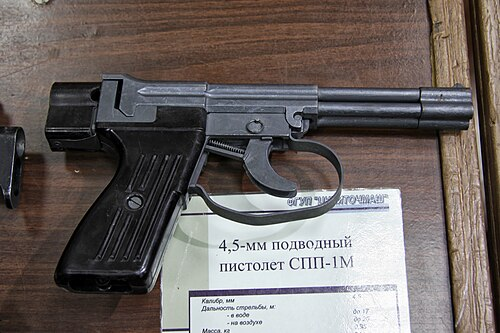

# Pistolet podwodny SPP-1M
### SPP-1M Underwater Pistol | СПП-1М

---

## Opis

SPP-1M (Специальный Пистолет Подводный — Specjalny Pistolet Podwodny) to radziecki pistolet do strzelania pod wodą kalibru 4,5 mm SPS opracowany przez TSNIITOCHMASH i przyjęty do służby w 1971 roku dla płetwonurków bojowych i sił specjalnych marynarki wojennej. Używa specjalnych igłowych pocisków SPS — długich (120 mm), cienkich (4,5 mm) stalowych igieł stabilizowanych hydrodynamicznie w wodzie. Pod wodą zasięg skuteczny wynosi 17 m na głębokości 5 m i spada do 6 m na głębokości 40 m; na powierzchni zasięg to 20 m. SPP-1M ma cztery lufy naraz (czterolufowy rewolwer) — po jednej kulce w każdej lufie; przeładowanie zajmuje kilka sekund i wymaga wymiany "kasety" czterolufowej. Stosowany przez rosyjskie wojska podwodne Spetsnaz.

## Dane techniczne

| Parametr | Wartość |
|----------|---------|
| Typ | Pistolet podwodny czterolufowy |
| Kraj produkcji | ZSRR / Rosja |
| Rok wprowadzenia | 1971 |
| Kaliber | 4,5 mm SPS (igłowy) |
| Długość | 244 mm |
| Masa (bez pocisków) | 950 g |
| Liczba luf | 4 |
| Pojemność | 4 naboje (po jednym w lufie) |
| Zasięg (5 m głębokości) | 17 m |
| Zasięg (40 m głębokości) | 6 m |
| Zasięg (nad wodą) | 20 m |

## Charakterystyczne cechy rozpoznawcze

> Jak odróżnić SPP-1M od standardowych pistoletów:

- **Cztery widoczne otwory luf — "zestaw rur" z przodu:** SPP-1M ma charakterystyczny blok czterech luf widoczny z przodu; żaden standardowy pistolet nie ma czterech luf; ten "wiązkowy" przód jest natychmiastowym identyfikatorem
- **Igłowe pociski SPS — wyjątkowo długie i cienkie:** pociski SPS mają 120 mm długości i 4,5 mm średnicy — wyglądają jak metalowe igły lub cienkie gwoździe; przy załadowaniu lub obserwacji amunicji wyraźnie inne od standardowych nabojów pistoletowych
- **Brak typowego zamka samopowtarzalnego — rewolwerowa logika:** SPP-1M nie ma suwadła (slide) jak standardowy pistolet samopowtarzalny; kształt broni jest "stały" — jak rewolwer z osłoną; brak ruchu zamka po strzale
- **Prostokątny, "pudełkowy" kształt komory zamkowej z blokiem luf:** SPP-1M ma prosty prostokątny kształt bez wyraźnego "pistolowego" profilu; wyraźnie inna sylwetka od PM czy MP-443 — mniej "pistoletowy" a bardziej "narzędziowy" wygląd
- **Broń służby podwodnej — widoczna wyłącznie u płetwonurków:** SPP-1M pojawia się tylko na fotografiach wojsk podwodnych lub prezentacjach specjalistycznego uzbrojenia; widok SPP-1M na żołnierzu od razu sugeruje płetwonurka bojowego
- **Ciemnoszare lub czarne metalowe wykończenie bez plastiku:** SPP-1M jest w całości metalowy (aluminium i stal); brak plastikowych elementów różni go od nowoczesnych pistoletów polimerowych

## Ciekawostka

> SPP-1M jest bronią tak niszową, że przez dekady zachodnie wywiady nie były pewne jej istnienia — sowieccy płetwonurkowie Spetsnaz używali jej w najgłębszej tajemnicy. Pierwsza potwierdzona fotografia SPP-1M pojawiła się na zachodzie dopiero na początku lat 90. po rozpadzie ZSRR. Dla zachodnich specjalistów od uzbrojenia był to szok — okazało się, że ZSRR miał kompletny arsenał broni podwodnej (SPP-1M na pistolet, APS na karabin szturmowy, podwodne noże bojowe), o którym Zachód nie wiedział nic przez 20 lat.

