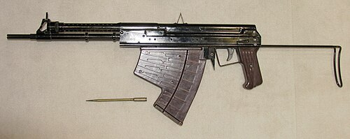

# Podwodny karabinek APS
### APS Underwater Assault Rifle | АПС (Автомат Подводный Специальный)

---

## Opis

APS (Автомат Подводный Специальный — Automatyczny Karabinek Podwodny Specjalny, nie mylić z pistoletem APS Steczkin) to radziecki karabin szturmowy do strzelania pod wodą kalibru 5,66 mm MPS opracowany przez TsNIITochMash i przyjęty do służby w 1975 roku dla płetwonurków bojowych. Używa specjalnych igłowych pocisków MPS (120 mm długości) stabilizowanych hydrodynamicznie w wodzie — identyczna zasada jak SPP-1M, ale w wersji automatycznej. Pod wodą na głębokości 5 m zasięg to 30 m; na 40 m — 11 m. Na powietrzu broń działa, ale celność i zasięg są mocno ograniczone (igły nie są stabilizowane przez lotki na powietrzu). Od ok. 2000 roku trwa zastępowanie przez ASM-DT "Morski Lew" który jest skuteczny zarówno pod wodą jak i na lądzie.

## Dane techniczne

| Parametr | Wartość |
|----------|---------|
| Typ | Automatyczny karabin podwodny |
| Kraj produkcji | ZSRR / Rosja |
| Rok wprowadzenia | 1975 |
| Kaliber | 5,66 mm MPS (igłowy) |
| Długość | 823 mm |
| Długość lufy | 300 mm |
| Masa (bez magazynka) | 2,46 kg |
| Pojemność magazynka | 26 nabojów |
| Szybkostrzelność | 600 strz./min |
| Zasięg (5 m głęb.) | 30 m |
| Zasięg (40 m głęb.) | 11 m |

## Charakterystyczne cechy rozpoznawcze

> Jak odróżnić APS podwodny od AKS-74U i broni specjalnej:

- **Wyraźnie inne proporcje — "zbyt długi i wąski" karabin:** APS podwodny ma bardzo długi, wąski wygląd z wyraźnie krótszą komorą niż długi magazynek; proporcje są inne od wszystkich karabinów AK
- **Igłowe pociski 5,66 mm widoczne w magazynku:** magazynek APS podwodnego wygląda inaczej — jest wąski i długi proporcjonalnie do pocisków-igieł; naboje MPS są długie i cienkie; widoczne przez okienko magazynka lub przy załadowaniu
- **Brak gazownika i innych typowych elementów AK:** APS podwodny nie ma klasycznego gazownika AK nad lufą; układ gazowy jest ukryty lub inaczej rozwiązany; brak charakterystycznej "opuszki" gazownika AK
- **Prosta, "rurowa" konstrukcja bez bocznych szyn i elementów:** APS podwodny jest prostym "narzędziem bojowym" bez szyn, bez ergonomicznych uchwytów — bo pod wodą ergonomia jest inna; prosta, "utylitarna" budowa
- **Broń widoczna wyłącznie u płetwonurków bojowych:** APS podwodny pojawia się wyłącznie w kontekście jednostek podwodnych Spetsnaz; widok tej broni na żołnierzu od razu identyfikuje płetwonurka bojowego lub prezentację specjalistycznego uzbrojenia
- **Prosta, nieregulowana plastikowa kolba:** kolba APS jest prosta i nieregulowana — inna od składanych i regulowanych kolb AKS i AK-12; brak mechanizmów składania (pod wodą kolba jest zawsze rozłożona)

## Ciekawostka

> APS podwodny był jednym z najbardziej skrywanych sekretów ZSRR przez lata 70.–80. — bo jego istnienie ujawniałoby plany sowieckich operacji podwodnych: sabotaż portów, niszczenie infrastruktury podwodnej, likwidacja nurków wroga. Kiedy APS pojawił się po raz pierwszy publicznie w latach 90., zachodni eksperci byli zdumieni: nikt nie wiedział, że Sowieci mają kompletny system broni podwodnej automatycznej. NATO natychmiast zaczęło planować odpowiedź — ale do dziś zachodni odpowiednik APS jest mniej zaawansowany; USA mają HK P11 (pistolet), ale nie mają automatycznej podwodnej broni porównywalnej z APS.

