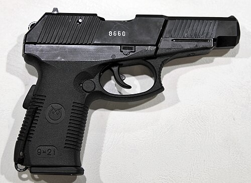

# Pistolet SR-1 Wektor (SPS)
### SR-1 Vektor (SPS) Pistol | СР-1 «Вектор» (СПС)

---

## Opis

SR-1 Wektor (Вектор — Wektor), oficjalnie SPS (Самозарядный Пистолет Сердюкова — Samopowtarzalny Pistolet Sierdiukowa), to rosyjski pistolet kalibru 9×21 mm SP-10 opracowany przez TsNIITochMash i przyjęty do służby w 1996 roku dla FSB i GRU. Wyróżnia się dedykowaną amunicją 9×21 mm SP-10, której stal-rdzeniowy pocisk przebija kamizelki IIIA z 50 m i 8 mm płyty stalowe; jest to jeden z najbardziej penetracyjnych pistoletów na świecie. SR-1 jest bronią stricte specjalną — dla operatorów wymagających pistoletu przebijającego opancerzone cele. Mechanizm zamkowy z obrotową lufą (podobnie jak GSz-18) redukuje odrzut. Stosowany przez FSB, GRU i sił specjalnych.

## Dane techniczne

| Parametr | Wartość |
|----------|---------|
| Typ | Pistolet samopowtarzalny wysokopenetracyjny |
| Kraj produkcji | Rosja |
| Rok wprowadzenia | 1996 |
| Kaliber | 9×21 mm SP-10 |
| Długość | 200 mm |
| Długość lufy | 120 mm |
| Masa (bez magazynka) | 900 g |
| Pojemność magazynka | 18 nabojów |
| Prędkość wylotowa | 400 m/s (SP-10) |
| Skuteczny zasięg | 50 m |

## Charakterystyczne cechy rozpoznawcze

> Jak odróżnić SR-1 od MP-443 i GSz-18:

- **Wyraźnie masywniejszy i grubszy od MP-443 i GSz-18:** SR-1 jest większy i cięższy od obydwu — wyraźna "mięsistość" broni; szeroki chwyt na magazynek 18-nabojowy; ogólna bryła jest solidna i duża jak na pistolet
- **Widoczna szyna pod lufą i nowoczesna ergonomia:** SR-1 ma szynę Picatinny pod lufą; ergonomia jest nowoczesna z wyraźnym trójkątnym profilem uchwytu; wygląd zbliżony do MP-443, ale masywniejszy
- **Charakterystyczny zewnętrzny kurek zaokrąglony (bobbed hammer):** SR-1 ma zewnętrzny kurek, ale jest ukryty i zaokrąglony; nie sterczy tak widocznie jak kurek PM; pośredni między zewnętrznym a wewnętrznym
- **Niestandardowy kaliber 9×21 mm — amunicja niekompatybilna z innymi:** SR-1 używa unikalnej amunicji 9×21 mm SP-10 niepasującej do żadnego innego pistoletu; przy obserwacji załadowania naboje są wyraźnie dłuższe od standardowych 9×19 mm Parabellum; ta "obca" amunicja identyfikuje SR-1
- **Rzadki — widoczny głównie u FSB i specnazowców:** SR-1 jest bronią elitarną i rzadką; jego widok na fotografii sugeruje operatora specjalnego FSB lub GRU; regularna policja i wojsko używają PM lub MP-443
- **Złożona gumowa lub polimerowa okładzina chwytu:** okładziny chwytu SR-1 są ergonomiczne z gumowymi wstawkami antypoślizgowymi; nowoczesny wygląd odróżnia od prostych okładzin PM

## Ciekawostka

> SR-1 Wektor był pierwszym rosyjskim pistoletem zaprojektowanym po zimnej wojnie z eksplicytnym wymaganiem "przebij kamizelkę IIIA". Projektanci TsNIITochMash mieli do dyspozycji analizy operacji FSB z lat 90., gdzie okazało się, że czeczeńscy bojownicy i gangsterzy nosili zachodnie kamizelki balistyczne — i standardowy PM był bezsilny. SR-1 z amunicją SP-10 był odpowiedzią: pistolet, który można nosić dyskretnie, ale który przebija to, czego PM nie przebija. Zachodnie analizy po pierwszym opisaniu SR-1 w publicznych źródłach w 2000 roku spowodowały przegląd standardów certyfikacji kamizelek NATO.

