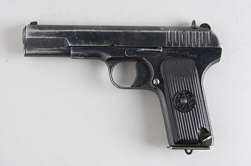

# Pistolet TT (Tulski Tokariew)
### TT (Tokarev) Pistol | ТТ (Тульский Токарев)

---

## Opis

TT (Тульский Токарев — Tulski Tokariew) to radziecki pistolet samopowtarzalny kalibru 7,62×25 mm TT zaprojektowany przez Fiodora Tokarjewa i przyjęty do służby w 1930 roku (TT-30) oraz 1933 roku (ulepszony TT-33). Charakteryzuje się prostą, niezawodną konstrukcją i bardzo energetycznym nabojem 7,62×25 mm — pocisk przenikający kamizelki balistyczne klasy I-II. TT był standardowym pistoletem wojska i NKWD/KGB przez II wojnę światową i wiele lat po niej; zastąpiony przez PM dopiero w 1951 roku. Mimo oficjalnego wycofania TT jest powszechny w krajach byłego ZSRR, Chinach (kopia Typ 54), Jugosławii i dziesiątkach innych krajów — i regularnie pojawia się w konfliktach zbrojnych.

## Dane techniczne

| Parametr | Wartość |
|----------|---------|
| Typ | Pistolet samopowtarzalny |
| Kraj produkcji | ZSRR |
| Rok wprowadzenia | 1930 (TT-30) / 1933 (TT-33) |
| Kaliber | 7,62×25 mm TT |
| Długość | 194 mm |
| Długość lufy | 116 mm |
| Masa (bez magazynka) | 854 g |
| Pojemność magazynka | 8 nabojów |
| Prędkość wylotowa | 420 m/s |
| Skuteczny zasięg | 50 m |

## Charakterystyczne cechy rozpoznawcze

> Jak odróżnić TT od PM i pistoletów zachodnich:

- **Wyraźnie większy i dłuższy od PM — bardziej "karabinowy" profil:** TT jest wyraźnie dłuższy (194 mm vs 161 mm PM) i masywniejszy; przy porównaniu TT sprawia wrażenie "pistoletu z innej epoki" — bardziej kanciasowego i prostokątnego
- **Brak zewnętrznego zabezpieczenia na zamku — tylko wewnętrzne:** TT nie ma dźwigni bezpiecznika na zewnątrz ramy (jak PM czy MP-443); to niebezpieczne w codziennym noszeniu — był to jeden z powodów zastąpienia go przez PM; brak zewnętrznego bezpiecznika jest widoczny
- **Płaskie, drewniane lub bakelitowe okładziny chwytu:** TT ma charakterystyczne płaskie okładziny z drewna lub bakelitu z reliefem w kształcie gwiazdki radzieckiej; PM ma gumowe lub plastikowe okładziny; stare drewniane okladziny TT są odróżnialne wizualnie
- **Wyraźna linia "zamka" (slide) biegąca poziomo wzdłuż górnej części:** TT ma charakterystyczny długi, prostokątny zamek z widocznymi rowkami ryflowania na tylnej części do naciągania; profil zamka jest bardzo geometryczny i "retro"
- **Nabój 7,62×25 mm — smuklejszy i dłuższy niż 9×18 mm PM:** nabój TT jest wyraźnie dłuższy i smuklejszy od naboju PM; przy obserwacji załadowania widać mniejszy kaliber a większą długość naboju; bardzo charakterystyczny wygląd amunicji
- **Brak szyny montażowej i żadnych nowoczesnych elementów:** TT nie ma szyn, nie ma celowników regulowanych, nie ma podświetlanych przyrządów; prosta archaiczna estetyka broni z lat 30. odróżnia od każdego nowoczesnego pistoletu

## Ciekawostka

> TT zyskał niechlubną sławę jako "ulubiony pistolet przestępców" w Rosji i krajach byłego ZSRR lat 90. — bo był tani, dostępny na czarnym rynku i przebijał ówczesne kamizelki policyjne. Rosyjscy policjanci byli dosłownie gorzej uzbrojeni niż przestępcy: policja miała PM (chroniony przed kamizelką I klasy), a zorganizowane grupy przestępcze — TT (przebijający kamizelki klasy II). Ta sytuacja przyspieszyła modernizację uzbrojenia rosyjskiej policji w latach 2000. i wprowadzenie MP-443 Grach.

