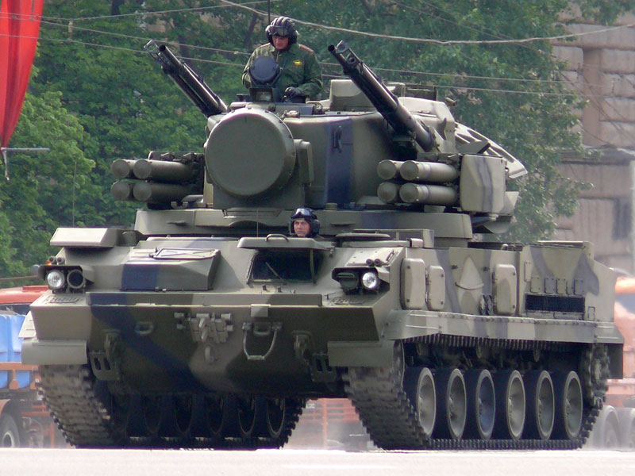

# 2K22 Tunguska — samobieżny zestaw rakietowo-artyleryjski
### 2K22 Tunguska SPAAG | 2К22 «Тунгуска»

---

## Opis

2K22 Tunguska to rosyjski samobieżny zestaw przeciwlotniczy (SPAAG) łączący dwie chłodzone cieczą armaty automatyczne 30 mm z 8 wyrzutniami rakiet 9M311. Wprowadzony do służby 8 września 1982 roku, przeznaczony do ochrony wojsk lądowych przed śmigłowcami, samolotami szturmowymi i dronami na dystansie 0–8 km. Reaktywny czas otwarcia ognia z armat wynosi zaledwie 8–10 sekund. Posiada własny radar Hot Shot do wykrywania (18 km) i śledzenia celów. Używany przez obie strony w Ukrainie.

## Dane techniczne

| Parametr | Wartość |
|----------|---------|
| Typ | Samobieżny zestaw rakietowo-artyleryjski |
| Kraj produkcji | ZSRR / Rosja |
| Rok wprowadzenia | 1982 (dostawy od 1984) |
| Masa | ok. 35 000 kg |
| Długość | 7,90 m |
| Szerokość | 3,25 m |
| Uzbrojenie artyleryjskie | 2× armata 30 mm 2A38M (dwulufowe), szybkostrzelność łączna 3900–5000 strz./min |
| Zasięg armat | 0,2–4,0 km |
| Uzbrojenie rakietowe | 8× rakieta 9M311 (lub 9M311-M1 w Tunguska-M1) |
| Zasięg rakiet | 8 km (9M311) / 10 km (9M311-M1) |
| Maksymalny pułap | 3500 m |
| Radar | 1RL144 "Hot Shot" — wykrywanie 18 km, śledzenie 16 km |
| Silnik | V-46 diesel, 710 KM |
| Prędkość maks. | 65 km/h |
| Załoga | 4 osoby |

## Charakterystyczne cechy rozpoznawcze

> Jak odróżnić 2K22 Tunguska od Pancyra i innych zestawów plot.:

- **Podwozie gąsienicowe** — Tunguska zawsze na gąsienicach (6 kół nośnych); Pancyr-S1 zwykle na kołowym podwoziu 8×8
- **Dwa bloki po 4 wyrzutnie rurowe po bokach wieży** — prostokątne kontenery z rakietami, wyraźnie odstawione od kadłuba po obu stronach wieży
- **Dwie bardzo długie lufy 30 mm pod blokami rakiet** — po jednej parabolicznej grupie luf pod każdym blokiem wyrzutni
- **Paraboliczny radar z tyłu wieży + okrągły radar śledzący z przodu** — dwa wyraźnie różne kształty anten na jednej wieży
- **Masywna, obrotowa wieża pośrodku kadłuba** — wieża zajmuje niemal całą górną część pojazdu

## Ciekawostka

> Rozwój Tunguski niemal porzucono na rzecz 9K33 Osa, ale analiza wykazała słabość Osy wobec śmigłowców wyłaniających się zza osłon — Osa potrzebuje 30 sekund na reakcję, Tunguska 8–10 sekund. Ukraina posiada ok. 75 sztuk; w Ukrainie Tunguski operują bezpośrednio na linii frontu, ukryte pod kamuflażem z gałęzi.
