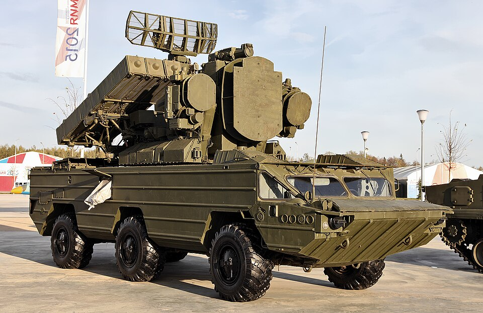

# 9K33 Osa — samobieżny zestaw rakietowy
### 9K33 Osa (SA-8 Gecko) SAM System | 9К33 «Оса»

---

## Opis

9K33 Osa (NATO: SA-8 Gecko) to radziecki samobieżny zestaw przeciwlotniczy krótkiego zasięgu, wprowadzony do służby w 1971–1972 roku. Był pierwszym na świecie systemem p-lot., który w pełni zintegrował radar wykrywania, radar śledzenia i wyrzutnie rakiet na jednym pojeździe (typ TELAR). W wersji Osa-AKM niesie 6 rakiet 9M33M3 o zasięgu do 15 km. Pojazd jest w pełni amfibijny (prędkość w wodzie 8 km/h), napędzany silnikiem diesla D20K300. Zarówno Ukraina jak i Rosja używają go w wojnie, a Ukraina zmodernizowała swoje egzemplarze do odpalania rakiet R-73 ("FrankenSAM").

## Dane techniczne

| Parametr | Wartość |
|----------|---------|
| Typ | Samobieżny zestaw rakietowy krótkiego zasięgu |
| Kraj produkcji | ZSRR |
| Rok wprowadzenia | 1971–1972 |
| Masa | 17,5 t |
| Długość | 9,14 m |
| Szerokość | 2,75 m |
| Podwozie | Kołowe BAZ-5937, 6×6 |
| Rakieta | 9M33 / 9M33M3 |
| Zasięg rakiet | 2–9 km (9M33) / do 15 km (9M33M3) |
| Pułap | 50–5000 m (9M33) / do 12 000 m (9M33M3) |
| Prędkość rakiety | ok. 1020 m/s (≈Mach 3) |
| Liczba rakiet | 6 (wersja Osa-AKM) |
| Radar | 1S51M3 (NATO: Land Roll) — wykrywanie 30 km, śledzenie 20 km |
| Silnik | D20K300 diesel |
| Prędkość maks. (droga) | 80 km/h |
| Prędkość w wodzie | 8 km/h |
| Zasięg | 500 km |
| Załoga | 5 osób |

## Charakterystyczne cechy rozpoznawcze

> Jak odróżnić 9K33 Osę od innych zestawów p-lot.:

- **Kołowe podwozie 6×6** — jedyny kompletny TELAR p-lot. na 6 kołach; żadne inne opancerzone TELAR-y na kołach 6×6 nie wyglądają podobnie
- **Eliptyczna antena wykrywająca na szczycie** — obracająca się elipsa widoczna na samym wierzchołku bloku radarowego
- **Dwa "talerze" namierzające po bokach bloku radarowego** — dwie paraboliczne anteny (jak "oczy") flankujące centralną okrągłą antenę śledzącą
- **6 żebrowanych kontenerów startowych po obu bokach bloku radarowego** — prostokątne, wyraźnie żebrowane pojemniki na rakiety (3+3)
- **Brak uzbrojenia artyleryjskiego** — w odróżnieniu od Tunguski i Pancyra, Osa nie ma dział

## Ciekawostka

> W 1987 roku wojska południowoafrykańskie zdobyły pod Cuito Cuanavale nienaruszoną Osę — pierwszą w rękach państwa spoza Układu Warszawskiego. Ukraina stworzyła zestaw "FrankenSAM" montując na wyrzutniach Osy rakiety lotnicze R-73 po wyczerpaniu oryginalnych 9M33. Radar Osy może jednocześnie naprowadzać dwie rakiety na jeden cel na różnych częstotliwościach.
