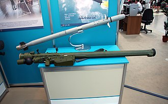

# Przenośny system rakietowy 9K38 Igła (MANPADS)
### 9K38 Igla Man-Portable Air Defence System | 9К38 «Игла»

---

## Opis

9K38 Igła (ros. «Игла» — igła; NATO: SA-18 Grouse) to radziecka przenośna wyrzutnia rakiet przeciwlotniczych (MANPADS), wprowadzona do służby w 1983 roku. Jest następcą systemu 9K34 Strieła-3 i znacznie skuteczniejsza od poprzednika — pocisk ma podwójny tryb naprowadzania i jest odporniejszy na flary termiczne. Igła może być obsługiwana przez jednego żołnierza i jest zdolna do zestrzelenia samolotów odrzutowych, śmigłowców i dronów latających na małych wysokościach. System był masowo dostarczany przez ZSRR i Rosję do sojuszniczych armii i ruchów partyzanckich — co sprawiło, że dziś jest w rękach dziesiątek państwowych i niepaństwowych podmiotów na całym świecie.

## Dane techniczne

| Parametr | Wartość |
|----------|---------|
| Typ | Przenośny system rakietowy p-lot (MANPADS) |
| Kraj produkcji | ZSRR / Rosja |
| Rok wprowadzenia | 1983 (Igła-1: 1981, Igła-S: 2004) |
| Zasięg maks. | 5–6 km (Igła-S: do 6 km) |
| Pułap raziący | do 3 500 m |
| Prędkość pocisku | Mach 1,9 |
| Masa gotowa do strzału | 17,9–19 kg |
| Głowica bojowa | 1,17 kg (Igła) / 2,5 kg (Igła-S) |
| Naprowadzanie | Pasywny IR (podczerwień), podwójny zakres spektralny |

## Charakterystyczne cechy rozpoznawcze

> Jak rozpoznać Igłę w terenie:

- **Długa zielona lub oliwkowa rura na ramieniu strzelca:** charakterystyczna cylindryczna wyrzutnia (~1,7 m długości) trzymana na ramieniu — żadna inna broń nie wygląda tak samo z odległości
- **Charakterystyczny czarny „cel" na końcu lufy:** z przodu wyrzutni widoczna jest zaślepka z charakterystycznym wzorem optycznym (znacznik IR) — po zdjęciu zaślepki widać głowicę poszukującą
- **Niebiesko-zielony kolor odróżnia od starej Strieły:** Igła jest zazwyczaj w kolorze ciemnooliwkowym lub zielonym, podczas gdy starsza Strieła-2 jest w kolorze piaskowo-brązowym (choć kolor zależy od operatora)
- **Duży blok elektroniczny z boku tuby — zasilanie i IFF:** z boku lub z tyłu wyrzutni widoczny jest charakterystyczny blok elektroniczny z akumulatorem chłodzącym — musi być aktywowany przed strzałem
- **Strzelec w pozycji stojącej z rurą na ramieniu:** sposób trzymania Igły (rura na prawym ramieniu, głowa po lewej stronie) jest charakterystyczny i odróżnia go od RPG czy granatnika
- **Brak celownika optycznego — tylko kimograf termiczny:** Igła nie ma lunetki — strzelec obserwuje cel przez prosty kimograf (wizjer) i słyszy sygnał dźwiękowy gdy głowica "złapie" cel

## Ciekawostka

> Igła odegrała kluczową rolę w wojnie w Afganistanie — ale po stronie mudżahedinów. USA dostarczyły im system FIM-92 Stinger, a ZSRR próbował bronić swoich śmigłowców. Paradoksalnie, po zakończeniu zimnej wojny CIA przez lata próbowała odkupić od różnych podmiotów nielegalne Igły i Stingery — bo obawiała się, że terroryści użyją ich do zestrzelenia samolotów pasażerskich. Szacuje się, że do dziś na czarnym rynku krąży kilka tysięcy niekontrolowanych egzemplarzy Igły.
