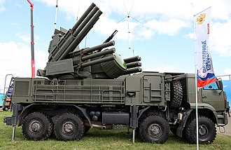

# Artyleryjsko-rakietowy system p-lot Pancerz-S1
### Pantsir-S1 Air Defence System | Панцирь-С1

---

## Opis

Pancerz-S1 (ros. Панцирь-С1 — pancerz) to rosyjski samobieżny artyleryjsko-rakietowy system obrony przeciwlotniczej bliskiego zasięgu, wchodzący do służby od 2012 roku. Łączy w jednym pojeździe dwa typy uzbrojenia: rakiety ziemia-powietrze (zasięg do 20 km) oraz podwójne działka automatyczne 30 mm (zasięg do 4 km), co zapewnia obronę wielowarstwową. System przeznaczony jest do ochrony obiektów stacjonarnych i baterii S-300/S-400 przed samolotami, śmigłowcami, dronami i pociskami manewrującymi. W wojnie w Ukrainie Pancerz-S1 poniósł znaczne straty od ukraińskich dronów — co ujawniło jego słabość wobec tanich, licznych BSL.

## Dane techniczne

| Parametr | Wartość |
|----------|---------|
| Typ | Samobieżny system artyleryjsko-rakietowy p-lot |
| Kraj produkcji | Rosja |
| Rok wprowadzenia | 2012 |
| Zasięg rakiet | do 20 km |
| Zasięg działek 30 mm | do 4 km |
| Pułap raziący (rakiety) | do 15 000 m |
| Pułap raziący (działka) | do 3 000 m |
| Pojazd bazowy | KAMAZ-6560 (8×8) lub gąsienicowy GM-352 |
| Obsługa | 3 osoby + kierowca |
| Rakiety na wozie | 12 pocisków 57E6 |

## Charakterystyczne cechy rozpoznawcze

> Jak rozpoznać Pancerz-S1:

- **Dwa duże radary na dachu — jeden śledzący, jeden naprowadzający:** charakterystyczna para anten radarowych na wieżyczce — duża antena śledzenia i mniejsza naprowadzania — jednocześnie obracające się w różnym rytmie
- **Dwa bloki po 6 rakiet po bokach wieżyczki:** po obu stronach centralnej wieży widoczne są dwa charakterystyczne prostokątne bloki z 6 pionowymi pojemnikami rakietowymi każdy — łącznie 12 rakiet
- **Dwie lufy 30 mm wystające z boków wieżyczki:** charakterystyczne podwójne lufy działek automatycznych umieszczone symetrycznie po lewej i prawej stronie wieżyczki, poniżej bloków rakietowych
- **Pojazd bazowy KAMAZ z charakterystyczną kabiną:** ciężarówka KAMAZ-6560 ma charakterystyczną prostokątną kabinę — inne proporcje niż pojazdy S-300/S-400
- **Okrągła wieżyczka z "ramionami" rakietowymi:** z góry widać centralną okrągłą wieżyczkę z dwoma "ramionami" po bokach — każde ramię to blok rakietowy
- **Krótszy i szerszy niż S-300/S-400:** Pancerz jest wyraźnie niższy i mniej smukły od wyrzutni S-300 — cały system mieści się na jednym pojeździe, podczas gdy S-300 potrzebuje kilku

## Ciekawostka

> W Syrii nagranie drona kamikaze niszczy Pancerz-S1, który w tym czasie stał nieruchomo bez aktywnego radaru — system był "uśpiony". Analitycy NATO stwierdzili, że to właśnie jest główna słabość Pancerza: radar musi być aktywny, żeby system działał, a aktywny radar zdradza pozycję. Twórcy systemu odpowiedzieli, że Pancerz nigdy nie miał działać samodzielnie — zawsze w zestawie z S-300/S-400, pod ich "parasolem".
