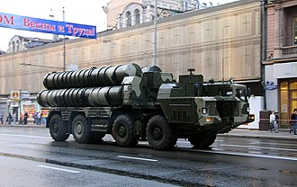

# System rakietowy dalekiego zasięgu S-300
### S-300 Long-Range Air Defence System | С-300

---

## Opis

S-300 (NATO: SA-10 Grumble) to rodzina radzieckich i rosyjskich systemów rakiet przeciwlotniczych dalekiego zasięgu, wprowadzona do służby w 1978 roku. Jest jednym z najskuteczniejszych systemów obrony przeciwlotniczej na świecie — przez dekady stanowił kręgosłup radzieckiej i rosyjskiej obrony powietrznej. System może jednocześnie śledzić i atakować wiele celów powietrznych, w tym samoloty, śmigłowce, pociski manewrujące, a nowsze warianty także pociski balistyczne. S-300 jest rozmieszczany na samochodach ciężarowych (wersja mobilna) lub stacjonarnie. Doświadczenia z Ukrainy pokazały zarówno jego skuteczność, jak i podatność na ataki dronów i precyzyjnych rakiet manewrujących.

## Dane techniczne

| Parametr | Wartość |
|----------|---------|
| Typ | Samobieżny system rakiet p-lot dalekiego zasięgu |
| Kraj produkcji | ZSRR / Rosja |
| Rok wprowadzenia | 1978 (S-300P); liczne modernizacje |
| Zasięg (maks.) | 40–400 km (zależnie od wariantu i pocisku) |
| Pułap raziący | 25 m – 27 000 m |
| Pociski | 5V55 / 48N6 / 40N6 (zależnie od wersji) |
| Naprowadzanie | Półaktywny radar / Aktywny radar (nowsze wersje) |
| Pojazd bazowy | Ciężarówka MAZ-543 (8×8) lub gąsienicowy |
| Wyrzutnia | 4 pociski na TEL |
| Czas gotowości | 5 minut (bojowa) |

## Charakterystyczne cechy rozpoznawcze

> Jak rozpoznać system S-300 w terenie lub na zdjęciach:

- **Pionowe wyrzutnie na ciężarówce 8×8 (TEL):** charakterystyczne cztery pionowe pojemniki startowe na platformie ciężarówki MAZ-543 — pociski wystrzeliwane są pionowo w górę, a następnie skręcają w kierunku celu (VLS)
- **Duża kabina radarowa na osobnym pojeździe:** radar śledzenia celów (36D6 lub 64N6) to charakterystyczna duża obracająca się antena — zawsze na osobnym pojeździe towarzyszącym baterii
- **Cylindryczne pojemniki transportowo-startowe:** każdy pocisk jest zamknięty w długim walcowatym pojemniku (ok. 7 m długości) — 4 takie pojemniki widoczne pionowo na platformie TEL
- **Biało-szare kontenery z charakterystycznym zielonym oznakowaniem:** bateria S-300 składa się z kilku pojazdów o podobnym kształcie pudełkowych kontenerów na ciężarówkach
- **Długie anteny i kable łączące pojazdy:** na stanowisku ogniowym bateria S-300 jest widoczna jako skupisko kilku pojazdów połączonych kablami
- **Charakterystyczny "dźwięk" pasywnego radaru:** w dzień — obracająca się duża antena na pojeździe radiolokacyjnym to nieodłączny element każdej baterii

## Ciekawostka

> Zakup systemu S-300 przez Turcję (NATO) w 2019 roku wywołał największy kryzys dyplomatyczny w historii Sojuszu — USA wykluczyły Turcję z programu myśliwców F-35 i nałożyły sankcje. Paradoksalnie Turcja nigdy nie włączyła S-300 do swojej obrony powietrznej i system stał nieaktywny w magazynach — zakup był prawdopodobnie kartą przetargową w negocjacjach z USA, a nie prawdziwą potrzebą militarną.
