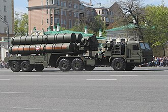

# System rakietowy dalekiego zasięgu S-400 Triumf
### S-400 Triumf Air Defence System | С-400 «Триумф»

---

## Opis

S-400 Triumf (NATO: SA-21 Growler) to rosyjski system rakiet przeciwlotniczych dalekiego zasięgu, zatwierdzony do służby w 2007 roku jako bezpośredni następca S-300. Jest uważany za jeden z najskuteczniejszych systemów obrony powietrznej na świecie i stanowi jeden z najważniejszych rosyjskich produktów eksportowych w dziedzinie uzbrojenia. System może zwalczać samoloty, śmigłowce, drony, pociski manewrujące oraz pociski balistyczne na odległość do 400 km i pułapie do 30 km. Zdolność do jednoczesnego śledzenia 300 celów i angażowania 36 z nich czyni go niezwykle trudnym do przełamania dla przeciwnika. Zakup S-400 przez Turcję (2019) i Indie wywołał poważne napięcia dyplomatyczne z USA.

## Dane techniczne

| Parametr | Wartość |
|----------|---------|
| Typ | System rakiet p-lot dalekiego zasięgu |
| Kraj produkcji | Rosja |
| Rok wprowadzenia | 2007 |
| Zasięg maks. (pocisk 40N6E) | 400 km |
| Zasięg maks. (pocisk 48N6DM) | 240 km |
| Zasięg krótki (pocisk 9M96M) | 120 km |
| Pułap raziący | do 30 000 m |
| Naprowadzanie | Aktywny / półaktywny radar (zależnie od pocisku) |
| Pojazd bazowy | MZKT-7930 (8×8) |
| Śledzenie celów | do 300 jednocześnie |
| Równoczesne zaangażowanie | do 36 celów |

## Charakterystyczne cechy rozpoznawcze

> Jak odróżnić S-400 od S-300:

- **Nowszy, bardziej smukły kształt pojemników startowych:** pojemniki TEL S-400 są nieco dłuższe i smuklejsze niż S-300; montowane na nowszych ciężarówkach MZKT-7930 o wyraźnie innym kształcie kabiny
- **Kabina ciężarówki MZKT-7930 — charakterystyczny prostokątny kształt:** pojazd bazowy S-400 (MZKT) ma bardziej nowoczesną, bardziej prostokątną kabinę niż starsze MAZ-543 S-300
- **8 pojemników startowych na TEL (lub 4):** w zależności od wariantu pojazd TEL może nieść 4 duże lub 8 mniejszych pojemników; konfiguracja 8×9M96 jest charakterystyczna tylko dla S-400
- **Radar 91N6E "Big Bird" — duża eliptyczna antena na wysięgniku:** radar S-400 ma charakterystyczną dużą, eliptyczną antenę na składanym maszcie — wyraźnie inną od radarów S-300
- **Zestaw pojazdów — zawsze minimum 4–5 jednostek:** bateria S-400 to zawsze zgrupowanie kilku pojazdów: radar, wyrzutnie, pojazd dowodzenia, zasilacz
- **Pionowy start i moment skręcenia pocisku:** S-400 startuje pionowo (jak S-300) — po odpaleniu widoczny jest biały dym z pionowo lecącego pocisku, który po sekundzie gwałtownie skręca w kierunku celu

## Ciekawostka

> S-400 jest pierwszym na świecie systemem, który może używać czterech różnych typów pocisków jednocześnie — od krótkiego zasięgu 9M96E (40 km) po pociski dalekiego zasięgu 40N6E (400 km). Pozwala to jednej baterii na zwalczanie zarówno dronów latających nisko, jak i samolotów AWACS krążących wysoko z dala od frontu. Producent (Ałmaz-Antiej) twierdzi, że S-400 może zestrzelić nawet cele stealth — choć ta właściwość nie była dotąd potwierdzona w warunkach bojowych.
