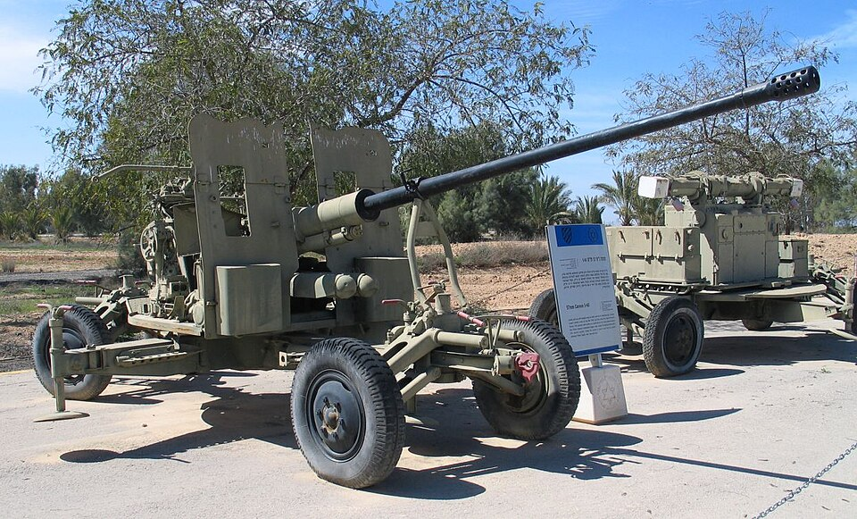

# S-60 — holowane działko przeciwlotnicze 57 mm
### S-60 (AZP S-60) Anti-Aircraft Gun | АЗП С-60

---

## Opis

S-60 (57 mm AZP S-60) to radziecka jednolufowa armata przeciwlotnicza kalibru 57 mm, wprowadzona do służby w 1950 roku. Zaprojektowana na bazie zdobycznych niemieckich prototypów z II wojny światowej, przez dekady stanowiła trzon pułkowej artylerii przeciwlotniczej Układu Warszawskiego i była eksportowana do ponad 40 krajów. Działa z systemem kierowania ogniem SON-9 i przelicznikiem PUAZO-6-60, dzięki czemu może zwalczać cele na pułapie do 6000 m. W Ukrainie obie strony używają S-60 zarówno jako klasycznej broni p-lot., jak i artylerii polowej.

## Dane techniczne

| Parametr | Wartość |
|----------|---------|
| Typ | Holowana armata przeciwlotnicza |
| Kraj produkcji | ZSRR |
| Rok wprowadzenia | 1950 |
| Masa | 4660 kg |
| Kaliber | 57 mm (nabój 57×347mmSR) |
| Szybkostrzelność | 105–120 strz./min (cykliczna); 70 strz./min (praktyczna) |
| Prędkość wylotowa | 1000 m/s |
| Skuteczny zasięg poziomy | 6000 m (radar) / 4000 m (optyka) |
| Kąt podniesienia | −4° do +85° |
| System KO | SON-9 / PUAZO-6-60 (radar Grom-2 10 cm) |
| Obsługa | 7 osób |

## Charakterystyczne cechy rozpoznawcze

> Jak odróżnić S-60 od ZU-23-2 i innych działek p-lot.:

- **Jedna gruba lufa 57 mm** — w odróżnieniu od dwulufowego ZU-23-2; lufa wyraźnie grubsza i dłuższa
- **Duże cztery koła + cztery wysięgniki stabilizujące** — holowana na 4 kołach, w pozycji bojowej 4 ramiona rozkładają się na boki i unoszą koła od ziemi
- **Masywna tarcza ochronna dla obsługi** — charakterystyczna prostokątna osłona po lewej stronie lufy
- **Wyraźnie cięższa od ZU-23-2** — 4660 kg vs 950 kg; widać to po rozmiarach łoża i kół
- **Brak sprzęgnięcia** — pojedyncza lufa, nie podwójna jak w ZU-23-2 lub poczwórna jak w ZSU-23-4

## Ciekawostka

> Radzieccy konstruktorzy oparli S-60 na zdobytych niemieckich prototypach z WWII — w tym na działku 5,5 cm Gerät 58. Przelicznik PUAZO-5A powstał z kolei na bazie niemieckiego kalkulatora "Lambda". W Ukrainie Rosjanie montują S-60 na dachach MT-LB, a separatyści LNR wsadzili go w miejsce wieży T-55, tworząc improwizowany "czołg przeciwdronowy". Ukraina używa S-60 jako artylerii polowej — działo trafia cel na 6,1 km.
