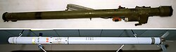

# Przenośny system rakietowy 9K34 Strieła-3 (MANPADS)
### 9K34 Strela-3 Man-Portable Air Defence System | 9К34 «Стрела-3»

---

## Opis

9K34 Strieła-3 (NATO: SA-14 Gremlin) to radziecki przenośny system rakietowy przeciwlotniczego wprowadzony do służby w 1974 roku jako ulepszenie starszej Strieły-2. Kluczowym postępem w stosunku do poprzednika jest zastosowanie modulowanego szukacza IR chłodzonego azotem, co znacznie zwiększyło odporność na zakłócenia i flary termiczne oraz umożliwiło atakowanie celów na kursie zbliżającym (nie tylko od tyłu). Strieła-3 była masowo eksportowana do sojuszniczych armii i ruchów wyzwoleńczych — dziś jest w rękach aktorów państwowych i niepaństwowych w kilkudziesięciu krajach. W armii rosyjskiej zastąpiła ją Igła, ale Strieła-3 jest wciąż spotykana w magazynach i na polach bitew Ukrainy i Bliskiego Wschodu.

## Dane techniczne

| Parametr | Wartość |
|----------|---------|
| Typ | Przenośny system rakietowy p-lot (MANPADS) |
| Kraj produkcji | ZSRR |
| Rok wprowadzenia | 1974 |
| Zasięg maks. | 4 500 m |
| Pułap raziący | 3 000 m (cele wolne), 1 800 m (odrzutowce) |
| Prędkość pocisku | 470 m/s |
| Masa gotowa do strzału | 16 kg |
| Głowica bojowa | 1,17 kg (odłamkowo-kumulacyjna) |
| Naprowadzanie | Pasywny IR, FM-modulowany, chłodzony azotem |

## Charakterystyczne cechy rozpoznawcze

> Jak odróżnić Striełę-3 od Igły i Stingera:

- **Piaskowo-brązowy lub oliwkowy kolor tuby:** Strieła-3 jest zazwyczaj w kolorze piaskowo-brązowym lub oliwkowym — Igła jest ciemnozielona; kolor to szybki (choć nie zawsze pewny) odróżnik
- **Starsza, prostsza głowica poszukująca z przodu:** głowica IR Strieły-3 jest nieco szersza i mniej smukła niż w Igle; widoczna po zdjęciu zaślepki jako okrągłe szkło szukacza
- **Brak podwójnego zakresu spektralnego:** Strieła-3 ma szukacz jednopasmowy (podczerwień) — nie ma dodatkowego filtra UV jak Igła; to różnica techniczna niewidoczna z zewnątrz, ale wpływająca na podatność na flary
- **Krótszy blok zasilania niż Igła:** akumulator/zasilacz z tyłu wyrzutni Strieły-3 jest nieco krótszy i lżejszy niż masywniejszy blok Igły-S
- **Brak identyfikatora IFF:** starsza Strieła-3 standardowo nie ma wyposażenia do rozpoznania swój-obcy; nowsze wersje Igły mają IFF jako opcję
- **Tuba wyrzutni nieco cieńsza od Igły:** proporcje wyrzutni Strieły-3 są nieco smuklejsze; przy bezpośrednim porównaniu różnica jest zauważalna

## Ciekawostka

> Strieła-3 (SA-14) stała się pierwszym MANPADS-em który zestrzelił izraelski śmigłowiec bojowy w 1982 roku podczas inwazji na Liban. PLO użyła jej do zestrzelenia UH-1 Huey — co było wielkim zaskoczeniem dla Izraelczyków, którzy nie spodziewali się tak zaawansowanej broni w rękach nieregularnych. To zdarzenie zmieniło reguły gry dla wszystkich sił lotniczych operujących na niskich pułapach nad obszarami konfliktu.
