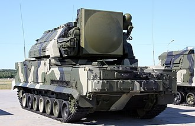

# System rakietowy krótkiego zasięgu Tor
### Tor Air Defence System | Тор (9К330)

---

## Opis

Tor (NATO: SA-15 Gauntlet) to radziecki/rosyjski samobieżny system obrony przeciwlotniczej krótkiego zasięgu, wprowadzony do służby w 1986 roku. Przeznaczony jest do ochrony wojsk na polu walki przed samolotami, śmigłowcami, pociskami manewrującymi i dronami na małych i średnich wysokościach. Tor jest systemem w pełni zintegrowanym — jeden pojazd gąsienicowy zawiera zarówno radar, wyrzutnię 8 pocisków, jak i system kierowania ogniem. Może zwalczać cele na odległość do 12 km i pułapie do 6000 m. System zyskał smutną sławę w 2020 roku, gdy irański Tor-M1 zestrzelił ukraiński samolot pasażerski Lot 752 — zdarzenie, które Iran początkowo zaprzeczał przez kilka dni.

## Dane techniczne

| Parametr | Wartość |
|----------|---------|
| Typ | Samobieżny system rakietowy p-lot krótkiego zasięgu |
| Kraj produkcji | ZSRR / Rosja |
| Rok wprowadzenia | 1986 (Tor-M1: 1991, Tor-M2: 2016) |
| Zasięg maks. | 12 km (Tor-M1), 16 km (Tor-M2) |
| Pułap raziący | do 6 000 m (Tor-M2: do 10 000 m) |
| Liczba rakiet | 8 gotowych do odpalenia |
| Czas reakcji | 5–8 sekund |
| Pojazd bazowy | Gąsienicowy GM-569 |
| Prędkość pojazdu | 65 km/h |
| Masa bojowa | 34 t |
| Załoga | 3 osoby |

## Charakterystyczne cechy rozpoznawcze

> Jak rozpoznać Tor w terenie:

- **Duża prostokątna skrzynia z 8 pionowymi wyrzutniami na wierzchu:** górna część pojazdu to charakterystyczna prostokątna platforma z 8 wyrzutniami pionowymi — widoczna z każdej strony jako "blok" na wierzchu kadłuba
- **Dwa radary — jeden z przodu, jeden z tyłu:** na wieżyczce Tora zawsze widać dwie różne anteny: jedną do wykrywania celów (większa, obracająca się szybko) i jedną do naprowadzania (mniejsza, nieruchoma lub wolnoobrotowa)
- **Gąsienicowe podwozie bez wieży bocznej:** Tor porusza się na gąsienicach i wygląda jak "jeżdżący kontener" — brak tradycyjnej artyleryjskiej wieży z lufą jest natychmiastowym rozpoznaniem
- **Charakterystyczna kwadratowa antena z przodu pojazdu:** panel antenowy radaru śledzenia celów na przedniej górnej ścianie pojazdu — prostokątny, z charakterystycznym wzorem otworów
- **Dużo wyższy niż szerszy — sylwetka "wieży":** Tor jest pojazdem nieproporcjonalnie wysokim w stosunku do długości — jego sylwetka bardziej przypomina wieżę niż pojazd bojowy
- **Brak lufy — tylko pionowe pojemniki:** nie ma żadnej widocznej lufy czy armaty — tylko pionowe rury wyrzutni na wierzchu, co go natychmiast odróżnia od systemów artyleryjskich

## Ciekawostka

> W lipcu 2014 roku ukraińskie wojsko podało, że samolot transportowy An-26 lecący na wysokości 6500 m został zestrzelony pociskiem, który "nie mógł" dosięgnąć takiej wysokości według oficjalnych parametrów Tora. Analitycy wywnioskwali, że Rosja użyła wariantu Tor-M2U z nieopublikowanymi parametrami zasięgu. Ta historia pokazuje, że oficjalne dane techniczne systemów rosyjskich są często celowo zaniżane.
