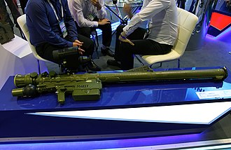

# Przenośny system rakietowy 9K333 Wierba (MANPADS)
### 9K333 Verba Man-Portable Air Defence System | 9К333 «Верба»

---

## Opis

9K333 Wierba (ros. «Верба» — wierzba; NATO: SA-25) to rosyjski przenośny system rakietowy czwartej generacji, przyjęty do służby w 2014 roku jako następca Igły-S. Kluczową innowacją jest wielospektralny szukacz IR pracujący jednocześnie w trzech zakresach: ultrafiolet, bliski IR i średni IR — co czyni Wierbę praktycznie odporną na nowoczesne flary termiczne i aktywne zakłócacze. System może zwalczać samoloty, śmigłowce, drony i pociski manewrujące o małej sygnaturze cieplnej. Wierba jest podłączona do systemu zautomatyzowanego zarządzania ogniem — strzelec może otrzymać dane o celu elektronicznie bez konieczności samodzielnego wyszukiwania. Jest to aktualnie najnowocześniejszy MANPADS w arsenale rosyjskim.

## Dane techniczne

| Parametr | Wartość |
|----------|---------|
| Typ | Przenośny system rakietowy p-lot 4. generacji (MANPADS) |
| Kraj produkcji | Rosja |
| Rok wprowadzenia | 2014 (oficjalnie 2015) |
| Zasięg maks. | 6 500 m |
| Pułap raziący | do 4 500 m |
| Prędkość pocisku | Mach 1,5 (500 m/s) |
| Masa gotowa do strzału | 17,25 kg |
| Głowica bojowa | 1,5 kg |
| Naprowadzanie | Pasywny IR multispektralny (UV + bliski IR + średni IR) |

## Charakterystyczne cechy rozpoznawcze

> Jak odróżnić Wierbę od Igły i starszych MANPADS:

- **Nowocześniejsza, bardziej smukła tuba z wyraźnie inną głowicą:** głowica szukająca Wierby jest cieńsza i dłuższa niż Igły — wynika to z trójzakresowego szukacza wymagającego więcej optyki
- **Elektroniczny celownik z wyświetlaczem (opcja):** zestaw Wierby może być sprzężony z naziemnym stanowiskiem docelowania z ekranem — widocznym jako dodatkowy element przy stanowisku strzeleckim
- **Ciemnozielony kolor tuby (jak Igła):** Wierba jest w standardowym rosyjskim kolorze zielonym — jak Igła; odróżnienie od Igły na podstawie samego koloru jest trudne bez bliższego przyjrzenia się
- **Dłuższa i smuklejsza tuba niż Igła:** Wierba jest nieznacznie dłuższa od Igły — widoczne przy bezpośrednim porównaniu lub zestawieniu zdjęć
- **Nowszy blok elektroniczny z większą powierzchnią:** blok zasilania/chłodzenia z tyłu jest nieco większy niż w starszej Igle, z nowocześniejszą obudową
- **Stanowisko zintegrowane z systemem zarządzania polem walki:** Wierba jest zazwyczaj częścią sieciowego zestawu z anteniną danych — strzelec ma dodatkowy moduł komunikacji przy sobie

## Ciekawostka

> Wierba była jednym z pierwszych rosyjskich systemów uzbrojenia przetestowanych w walce niemal natychmiast po wprowadzeniu do służby — trafiła do Syrii w 2015 roku, rok po przyjęciu do uzbrojenia. Analitycy oceniali, że Rosja celowo przyspieszyła wdrożenie bojowe, by zebrać dane z rzeczywistych warunków walki i sprawdzić skuteczność trójspektralnego szukacza przeciw amunicji USA. To "battlefield testing" nowej broni stało się od tamtej pory rosyjską doktryną operacyjną.
