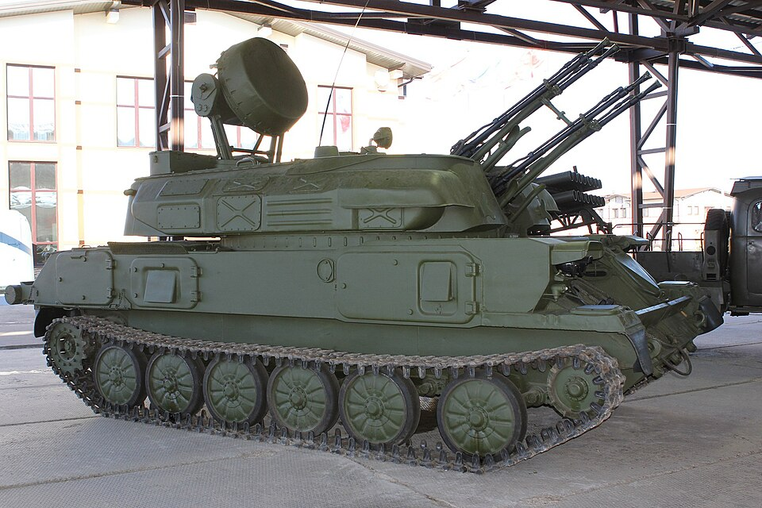

# ZSU-23-4 Szyłka — samobieżne działko przeciwlotnicze
### ZSU-23-4 Shilka Self-Propelled AA Gun | ЗСУ-23-4 «Шилка»

---

## Opis

ZSU-23-4 Szyłka to radziecka samobieżna zenitnaja samochódnaja ustanovka z poczwórnie sprzężonymi armatami 23 mm, wprowadzona do służby w 1965 roku. Łączna szybkostrzelność 4 luf wynosi 3400–4000 strz./min — co pozwala na kompletne wyczerpanie 2000 nabojów w 30 sekund. Posiada własny radar RPK-2 "Toboł" (NATO: Gun Dish) do autonomicznego śledzenia celów. Była standardem p-lot. pułków i dywizji Układu Warszawskiego. Dziś modyfikowana w Ukrainie do zwalczania dronów i użycia w walkach miejskich.

## Dane techniczne

| Parametr | Wartość |
|----------|---------|
| Typ | Samobieżne działko przeciwlotnicze |
| Kraj produkcji | ZSRR |
| Rok wprowadzenia | 1965 |
| Masa | 19 t |
| Długość | 6,54 m |
| Szerokość | 3,13 m |
| Wysokość (z radarem) | 3,57 m |
| Uzbrojenie | 4× armata automatyczna 23 mm 2A7 (system AZP-23 "Amur") |
| Zapas amunicji | 2000 nabojów (4×500) |
| Szybkostrzelność | 3400–4000 strz./min (łącznie) |
| Skuteczny zasięg / pułap | 2,5 km / 1,5 km |
| Radar | RPK-2 "Toboł" (NATO: Gun Dish), zasięg wykrywania 20 km |
| Silnik | V-6R diesel, 280 KM |
| Prędkość maks. | 50 km/h |
| Zasięg | 450 km |
| Załoga | 4 osoby (kierowca, dowódca, działonowy, operator radaru) |

## Charakterystyczne cechy rozpoznawcze

> Jak odróżnić ZSU-23-4 od innych pojazdów p-lot.:

- **Radar "talerz" z tyłu wieży** — okrągła antena radaru na składanych wspornikach, wyraźnie widoczna nad dachem wieży; podniesiony wygląda jak mała antena satelitarna
- **Blok czterech długich luf 23 mm z przodu wieży** — cztery lufy złączone w jedną masywną grupę, wycelowane w górę w pozycji marszowej
- **Duża, obudowana spawana wieża pośrodku podwozia** — zakrywa niemal cały kadłub; brak pancerza reaktywnego, cienkie ściany
- **6 kół nośnych z gumowymi bandażami** — podwozie PT-76/GM-575, koła jednolite z dużymi okrągłymi otworami
- **Brak wieżyczki dowódcy** — gładki dach wieży bez kopuły; wejście przez duże włazy na górze

## Ciekawostka

> Afgańczycy nazywali Szyłkę "maszyną do szycia" od charakterystycznego dźwięku 4 szybkostrzelnych luf. Wewnętrzny przelicznik balistyczny 1A7 SRP waży 180 kg i składa się z 60 silniczków i 110 osi zębatych — czysto mechaniczny komputer z lat 60. W Ukrainie Szyłki są przebudowywane na systemy "Doniec" (wieża na podwoziu T-80UD) i "Rokacz" (nowoczesny radar + rakiety Igła).
