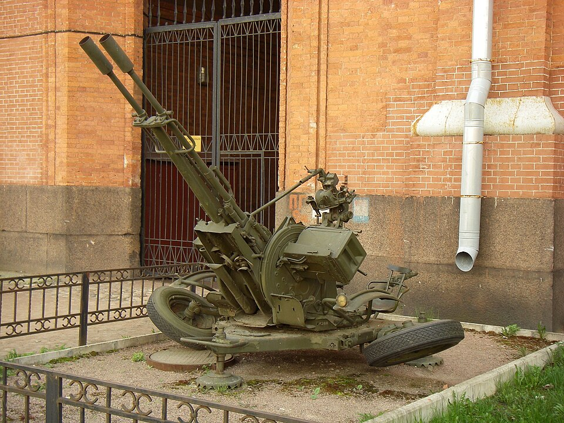

# ZU-23-2 — holowane działko przeciwlotnicze 23 mm
### ZU-23-2 Anti-Aircraft Gun | ЗУ-23-2

---

## Opis

ZU-23-2 (Zenitnaja Ustanovka) to radzieckie sprzężone działko przeciwlotnicze kalibru 23 mm, wprowadzone do służby w 1960 roku. Jest jednym z najbardziej rozpowszechnionych systemów przeciwlotniczych na świecie — znalazło się na wyposażeniu ponad 60 armii. Pomimo niskiej masy (950 kg) wyróżnia się niszczycielską szybkostrzelnością: 2000 strz./min teoretycznie, 400 strz./min praktycznie na jedną lufę. Poza obroną plot. powszechnie montowane na ciężarówkach i BTR-ach jako broń wsparcia piechoty. Używane przez obie strony w Ukrainie.

## Dane techniczne

| Parametr | Wartość |
|----------|---------|
| Typ | Holowane sprzężone działko przeciwlotnicze |
| Kraj produkcji | ZSRR |
| Rok wprowadzenia | 1960 |
| Masa | 950 kg |
| Kaliber | 23 mm (nabój 23×152B) |
| Liczba luf | 2 |
| Szybkostrzelność | 2000 strz./min (cykliczna); 400 strz./min (praktyczna / lufę) |
| Prędkość wylotowa | 970–980 m/s (BZT/OFZ); 1220 m/s (APDS-T) |
| Skuteczny zasięg poziomy | 2000–2500 m |
| Skuteczny pułap | 1500–2000 m |
| Kąt podniesienia lufy | −10° do +90° |
| Obsługa | 2 osoby (celowniczy + dowódca); pełen etat: 6 żołnierzy |

## Charakterystyczne cechy rozpoznawcze

> Jak odróżnić ZU-23-2 od innych działek plot.:

- **Dwie lufy 23 mm na dwukołowej przyczepie** — wyjątkowo lekka i kompaktowa; całość na małej przyczepce, w pozycji bojowej koła odchylają się na boki i działo opiera się na płytach oporowych
- **Skrzynki amunicyjne prostopadle do osi luf** — dwie 50-nabojowe skrzynki po obu stronach działka zamontowane pod kątem prostym do luf (wyraźna wizualna cecha)
- **Tłumiki płomienia na końcach obu luf** — charakterystyczne "kielichy" / szczeliny na końcach luf
- **Bardzo mała masa** — wyraźnie lżejsze i mniejsze niż S-60 (4660 kg) czy ZSU-23-4 (19 t)
- **Często montowane na MT-LB lub ciężarówkach** — jako "technical" z działkiem na dachu

## Ciekawostka

> W Finlandii ZU-23-2 ma ksywę "Sergei". Lufy przegrzewają się po ok. 100 strzałach — dlatego zestaw ma zawsze dwie pary luf zapasowych. W 2020 roku etiopscy żołnierze w Somalii zestrzelili z ZU-23 cywilny samolot transportujący moskitiery, myląc go z samolotem-bomba. W Ukrainie działka te są powszechnie montowane na MT-LB, BTR-80 i pick-upach jako broń wsparcia walki.
