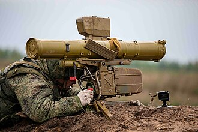

# Przeciwpancerny pocisk kierowany 9K111 Fagot
### 9K111 Fagot Anti-Tank Guided Missile | 9К111 «Фагот»

---

## Opis

9K111 Fagot (NATO: AT-4 Spigot) to radziecka przenośna wyrzutnia przeciwpancernych pocisków kierowanych, wprowadzona do służby w 1970 roku. System przeznaczony jest do rażenia pojazdów opancerzonych, fortyfikacji i pozycji ogniowych na odległość do 2500 m. Pocisk naprowadzany jest metodą SACLOS (półautomatyczne naprowadzanie po linii wzroku) za pomocą przewodu — obsługujący śledzi cel przez celownik, a elektronika automatycznie koryguje lot pocisku. Fagot jest lekki, przenośny i może być użyty przez 2-osobową obsługę. Pomimo zaawansowanego wieku jest wciąż stosowany przez armię rosyjską i dziesiątki innych armii na całym świecie.

## Dane techniczne

| Parametr | Wartość |
|----------|---------|
| Typ | Przenośny ppk (przewodowy SACLOS) |
| Kraj produkcji | ZSRR / Rosja |
| Rok wprowadzenia | 1970 |
| Zasięg min. / maks. | 70 / 2 500 m |
| Warhead | Kumulacyjna HEAT |
| Przenikanie pancerza | 400–600 mm stali jednolitej (RHA) |
| Prędkość pocisku | 186 m/s (maks.) |
| Czas lotu do 2500 m | ~13 s |
| Masa zestawu | ~22 kg (wyrzutnia + pocisk) |
| Obsługa | 2 osoby |

## Charakterystyczne cechy rozpoznawcze

> Jak rozpoznać zestaw Fagot w terenie:

- **Prostokątna wyrzutnia na trójnogu z celownikiem optycznym:** wyrzutnia ma charakterystyczny prostokątny kształt z boku — przypomina teleskop lub kamerę na trójnogu; żaden inny system ppk nie wygląda tak samo
- **Pudełkowy pojemnik startowy z pociskom:** pocisk w pojemniku startowym (metalowa skrzynka ~120 cm długości) jest wyraźnie widoczny po bokach lub z tyłu wyrzutni przed odpaleniem
- **Przewód sterowania wysuwający się po starcie:** charakterystyczny cienki drut (przewód sygnałowy) rozwijający się za lecącym pociskiem — widoczny na nagraniach jako błyszcząca linia za pociskiem
- **Biały dym odrzutowy przy starcie:** odpalenie daje charakterystyczny biały/szary dym po bokach wyrzutni (silnik startowy), a następnie pocisk leci z czerwonawym śladem spalin
- **Mały rozmiar zestawu:** całość jest kompaktowa i może być transportowana przez dwie osoby — wyrzutnia nie zajmuje więcej miejsca niż lekki karabin maszynowy na trójnogu
- **Celownik optyczny 9Sz16 po lewej stronie wyrzutni:** charakterystyczny duży celownik optyczny wystający po lewej stronie cylindrycznej wieży wyrzutni

## Ciekawostka

> Fagot był pierwszym radzieckim ppk z systemem SACLOS — obsługa musi jedynie utrzymać krzyżyk celownika na celu, a elektronika sama koryguje pocisk. To ogromny postęp w stosunku do poprzednich systemów pierwszej generacji (9M14 Malyutka), gdzie operator musiał ręcznie sterować pociskiem joystickiem. Statystyki z Afganistanu i Bliskiego Wschodu pokazują, że prawdopodobieństwo trafienia wzrosło z 50–60% (systemy 1. generacji) do ponad 90% przy SACLOS.
