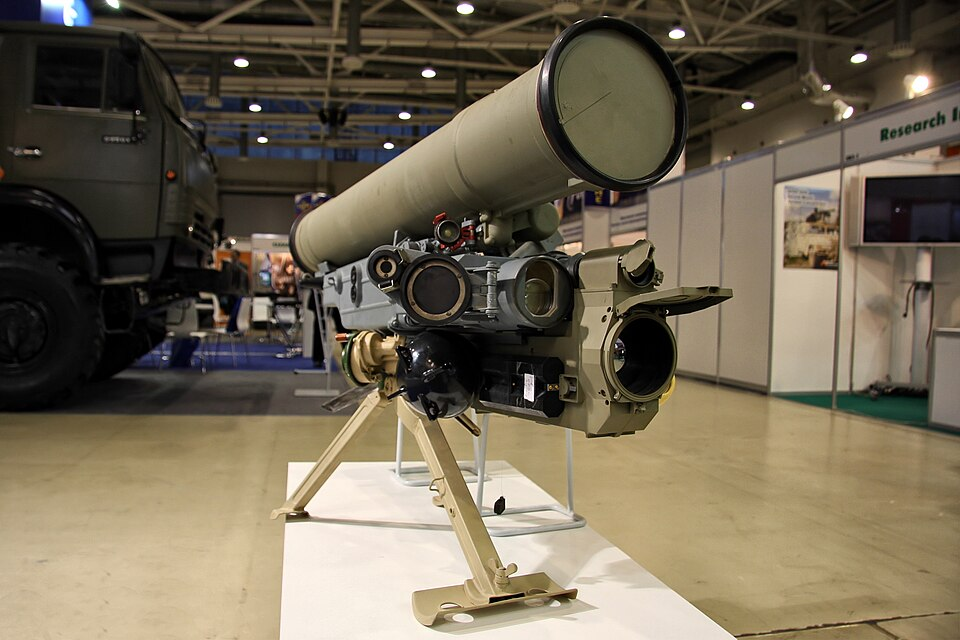

# Lekki ppk 9K115-2 Metis-M
### 9K115-2 Metis-M Anti-Tank Guided Missile | 9К115-2 «Метис-М»

---

## Opis

9K115-2 Metis-M (NATO: AT-13 Saxhorn-2) to rosyjski lekki przenośny ppk, wprowadzony do służby w 1992 roku jako modernizacja systemu Metis. Przeznaczony dla jednostek szczebla kompania — obsługa 3-osobowa przenosi cały system na plecach i może go rozwinąć do strzału w 15–20 sekund. Metis-M ma głowicę tandemową zdolną do przebicia ponad 800 mm pancerza, co pozwala na niszczenie czołgów wyposażonych w pancerz reaktywny ERA. Dostępna jest też głowica termobaryczna do niszczenia umocnień i schronów. System jest kompaktowy, lekki i tani w porównaniu do cięższych ppk, co czyni go popularnym na szczeblu kompania — zarówno w armii regularnej, jak i u niepaństwowych aktorów konfliktu.

## Dane techniczne

| Parametr | Wartość |
|----------|---------|
| Typ | Lekki ppk przewodowy SACLOS |
| Kraj produkcji | Rosja |
| Rok wprowadzenia | 1992 |
| Zasięg min. / maks. | 80 / 2 000 m (Metis-M1: do 2 000 m) |
| Warhead | Tandemowa HEAT / termobaryczna |
| Przenikanie pancerza | 800 mm (tandem), 900–980 mm (Metis-M1) |
| Masa pocisku | 13,8 kg |
| Masa wyrzutni | 10,2 kg |
| Szybkostrzelność | 3–4 strz./min |
| Obsługa | 3 osoby |

## Charakterystyczne cechy rozpoznawcze

> Jak odróżnić Metis-M od Fagota i Konkursa:

- **Znacznie mniejsza i lżejsza wyrzutnia niż Fagot:** wyrzutnia Metisa-M jest wyraźnie mniejsza — niższy trójnóg, mniejsza głowica celownicza — można ją pomylić z prostym monocelem, nie z ppk
- **Krótszy pojemnik pocisku niż Fagot:** pojemnik startowy Metisa jest krótszy i smuklejszy; łatwo odróżnić przy bezpośrednim porównaniu
- **Wyrzutnia bez charakterystycznego "teleskopu" Fagota:** wizjer Fagota jest duży i charakterystyczny; Metis-M ma mniejszy, bardziej kompaktowy celownik
- **Bardzo mały rozmiar całości — system "plecakowy":** cały zestaw Metis-M mieści się w trzech plecakach noszonych przez trzech żołnierzy; żaden inny ppk nie jest tak kompaktowy w transporcie
- **Białożółty kolor pojemnika startowego pocisku:** pojemniki pocisków Metisa mają charakterystyczny jasny (biały lub kremowy) kolor z żółtymi lub czarnymi oznaczeniami
- **Mały prostokątny blok elektroniczny na wyrzutni:** z boku wyrzutni widoczny jest charakterystyczny mały czarny blok elektroniczny z kablem — mniejszy niż w Fagocie i Konkursie

## Ciekawostka

> Metis-M jest jedynym rosyjskim ppk, który może być efektywnie obsługiwany przez jeden oddział piechoty bez specjalistycznego pojazdu. Trzyosobowy zespół może przenosić wyrzutnię i 5 pocisków na plecach, rozwinąć system w niezamieszkałym terenie w mniej niż 30 sekund i zwinąć go po strzale zanim przeciwnik zdąży odpowiedzieć. To właśnie ta mobilność sprawia, że Metis-M jest ulubioną bronią oddziałów dywersyjnych, sił specjalnych i nieregularnych.
