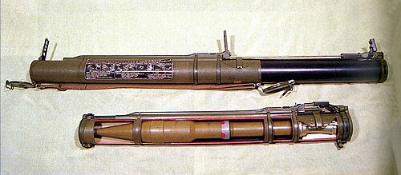

# Jednorazowy granatnik RPG-18 Mucha
### RPG-18 Mukha Disposable Rocket Launcher | РПГ-18 «Муха»

---

## Opis

RPG-18 Mucha (Муха — Mucha) to radziecki jednorazowy granatnik przeciwpancerny kalibru 64 mm opracowany przez GSKB-47 i przyjęty do służby w 1972 roku jako rosyjski odpowiednik amerykańskiego M72 LAW. Jest prostą, lekką bronią jednorazowego użytku — po wystrzeleniu wyrzuca się pustą tubus. Pocisk HEAT przebija do 200 mm pancerza jednolitego — wystarczający do rażenia lekkich pojazdów opancerzonych (BWP, APC, lekkie czołgi), ale niewystarczający do penetracji czołgów z pancerzem podstawowym. RPG-18 służy jako broń indywidualna żołnierza piechoty do rażenia lekkich celów opancerzonych i umocnień polowych. Wycofywany przez nowsze RPG-22, RPG-26, RPG-27, ale wciąż spotykany w magazynach.

## Dane techniczne

| Parametr | Wartość |
|----------|---------|
| Typ | Jednorazowy granatnik rakietowy (LAW) |
| Kraj produkcji | ZSRR / Rosja |
| Rok wprowadzenia | 1972 |
| Kaliber | 64 mm |
| Długość (złożony) | 705 mm |
| Długość (rozłożony do strzału) | 1 050 mm |
| Masa | 2,6 kg |
| Przenikanie pancerza | 200 mm |
| Zasięg skuteczny | 200 m |
| Obsługa | 1 osoba |

## Charakterystyczne cechy rozpoznawcze

> Jak odróżnić RPG-18 od RPG-22 i RPG-26:

- **Cylindryczna, teleskopowa tubus — rozkładana do strzału:** RPG-18 to cylindryczna tubus (jak rura), którą żołnierz rozkłada przed strzałem; w złożeniu jest krótka (70 cm), po rozłożeniu — 105 cm; stary, prosty wygląd "rury" bez dodatkowych elementów
- **Mniejszy kaliber 64 mm — cieńsza rura niż RPG-22 (72 mm):** RPG-18 ma kaliber 64 mm vs 72 mm RPG-22; przy bezpośrednim porównaniu rura RPG-18 jest cieńsza; to trudne do oceny bez porównania, ale istotna różnica techniczna
- **Brak widocznego celownika optycznego — prosty przyrząd:** RPG-18 ma minimalistyczny celownik (prosty wizjer mechaniczny); RPG-26 ma bardziej rozbudowany przyrząd celowniczy; prosty celownik to cecha starszych typów
- **Wyraźna archaiczna prostota — "stara rura":** RPG-18 wygląda jak najstarszy z serii jednorazowych granatników rosyjskich; nowsze (RPG-22, 26, 27) mają nowocześniejsze kształty i elementy; RPG-18 jest "retro" nawet wśród jednorazowych granatników
- **Jednorazowy — po strzale wyrzucana pusta tubus:** jak wszystkie jednorazowe granatniki — po strzale tubus jest wyrzucana; strzelec nie nosi jej po strzale; charakterystyczna porzucona aluminiowa rura na polu walki
- **Mniejszy i lżejszy od RPG-7 i RPG-29 — widoczna lekkość:** RPG-18 waży 2,6 kg; RPG-7 to 6,3 kg; żołnierz niesie RPG-18 jak lekki pakunek; RPG-7 jest wyraźnie większy i masywniejszy

## Ciekawostka

> RPG-18 zaprojektowano jako "broń dla każdego żołnierza" — w odróżnieniu od RPG-7, który wymagał wyszkolenia w obsłudze różnych głowic i konserwacji. Idea była prosta: dać każdemu żołnierzowi prostą rurę, którą można wyrzucić bez myślenia. Radzieckie eksperymenty z lat 70. wykazały, że z RPG-18 żołnierz po 15-minutowym szkoleniu mógł trafić w pojazd z 100 m — co było wystarczające do walki w warunkach miejskich. RPG-18 pojawił się szeroko w Afganistanie po obu stronach — mudżahedini zdobywali Muchy i używali ich przeciwko radzieckim pojazdom z zasadzekami.

