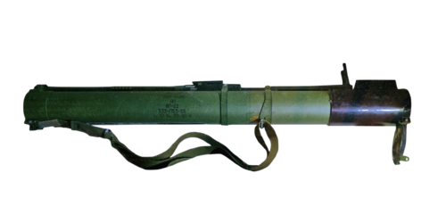

# Jednorazowy granatnik RPG-22 Netto
### RPG-22 Netto Disposable Rocket Launcher | РПГ-22 «Нетто»

---

## Opis

RPG-22 Netto (Нетто) to radziecki jednorazowy granatnik rakietowy kalibru 72,5 mm opracowany przez GSKB-47 i przyjęty do służby w 1980 roku jako modernizacja RPG-18. Powiększony kaliber (72,5 mm vs 64 mm RPG-18) i ulepszona głowica kumulacyjna dają przenikanie do 400 mm pancerza — dwa razy więcej niż RPG-18. RPG-22 jest ulepszoną wersją koncepcji "jednorazówki dla każdego żołnierza" — prosta, lekka (2,7 kg), niezawodna. Stosowany przez armie byłego ZSRR; wycofywany przez RPG-26 i RPG-27, ale wciąż spotykany w magazynach i na polach walki.

## Dane techniczne

| Parametr | Wartość |
|----------|---------|
| Typ | Jednorazowy granatnik rakietowy |
| Kraj produkcji | ZSRR / Rosja |
| Rok wprowadzenia | 1980 |
| Kaliber | 72,5 mm |
| Długość (złożony) | 755 mm |
| Długość (rozłożony do strzału) | 1 060 mm |
| Masa | 2,7 kg |
| Przenikanie pancerza | 400 mm |
| Zasięg skuteczny | 250 m |
| Obsługa | 1 osoba |

## Charakterystyczne cechy rozpoznawcze

> Jak odróżnić RPG-22 od RPG-18 i RPG-26:

- **Grubsza rura 72,5 mm — cieńsza od RPG-26 (72,5 mm podobny), grubsza od RPG-18 (64 mm):** RPG-22 i RPG-26 mają ten sam kaliber 72,5 mm — trudne do odróżnienia po grubości rury; główna różnica to oznaczenia i wygląd osłony celownika
- **Teleskopowa rura — rozsuwana do strzału:** RPG-22 (jak RPG-18) ma teleskopową tubę, którą rozsuwamy przed strzałem; RPG-26 jest nierozsuwany — rura jest stała; ta różnica w mechanizmie rozłożenia jest kluczowa
- **Mniejszy i prostszy celownik niż RPG-26:** RPG-22 ma prosto­kątny wizjer celowniczy mniejszy niż RPG-26; wygląd celownika jest "starszy" i prostszy
- **Wyraźnie prostszy mechanizm obsługi niż RPG-26:** RPG-22 wymaga ręcznego rozsunięcia tuby i odchylenia celownika; RPG-26 ma nowocześniejszy mechanizm uzbrojenia; przy obserwacji obsługi różnica jest widoczna
- **Jeden z najlżejszych jednorazowych granatników — 2,7 kg:** RPG-22 waży 2,7 kg — prawie tak samo jak RPG-18 (2,6 kg) i RPG-26 (2,9 kg); ta lekkość jest wspólna dla całej rodziny "lekkich jednorazówek"
- **Stary wygląd — archaiczna konstrukcja z lat 80.:** RPG-22 jest wizualnie starszy od RPG-26 i nowszych; prostsze elementy, mniej ergonomiczne uchwyty; "retro" wśród jednorazowych granatników

## Ciekawostka

> RPG-22 pojawił się w Afganistanie w 1981 roku i był pierwszą radziecką jednorazówką szeroko stosowaną w konflikcie. Sowieci dostarczali żołnierzom RPG-22 jako uzupełnienie RPG-7 — pierwszy raz żołnierze mogli nosić "zapas" rakiet w formie lekkich jednorazówek. Mudżahedini szybko nauczyli się ich używać ze zdobytych egzemplarzy. Paradoksalnie, "jednorazowa rura dla mas" stała się pożądanym łupem, bo był znacznie prostszy w obsłudze niż RPG-7 dla nieszkołonego bojownika.

