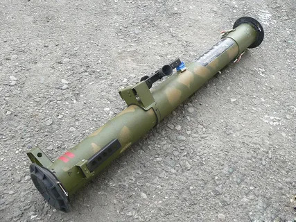

# Jednorazowy granatnik RPG-26 Agleń
### RPG-26 Aglen Disposable Rocket Launcher | РПГ-26 «Аглень»

---

## Opis

RPG-26 Agleń (Аглень — dawna nazwa miejscowości) to radziecki jednorazowy granatnik rakietowy kalibru 72,5 mm opracowany przez GSKB-47 i przyjęty do służby w 1985 roku jako bezpośredni następnik RPG-22. Ulepszona głowica kumulacyjna przebija do 440 mm pancerza jednolitego — znacznie więcej niż RPG-18 (200 mm) i RPG-22 (400 mm). RPG-26 jest standardową "jednorazówką" rosyjskiej piechoty — prosta, lekka (2,9 kg), niezawodna. Wystarczy do rażenia starszych czołgów od boku i tyłu (bez ERA), BWP, APC, MRAP i umocnień polowych. Wycofywany przez RPG-27, RPG-30 i bardziej zaawansowane systemy, ale wciąż powszechny w rosyjskich magazynach i na polach walki.

## Dane techniczne

| Parametr | Wartość |
|----------|---------|
| Typ | Jednorazowy granatnik rakietowy |
| Kraj produkcji | ZSRR / Rosja |
| Rok wprowadzenia | 1985 |
| Kaliber | 72,5 mm |
| Długość (złożony) | 770 mm |
| Długość (rozłożony do strzału) | 1 020 mm |
| Masa | 2,9 kg |
| Przenikanie pancerza | 440 mm |
| Zasięg skuteczny | 250 m |
| Obsługa | 1 osoba |

## Charakterystyczne cechy rozpoznawcze

> Jak odróżnić RPG-26 od RPG-18 i RPG-22:

- **Grubsza rura 72,5 mm — wyraźnie szersza niż RPG-18 (64 mm):** RPG-26 jest grubszy od RPG-18; przy bezpośrednim porównaniu różnica kalibrów 64 vs 72,5 mm jest wyczuwalna; RPG-26 i RPG-22 mają podobny kaliber, więc tutaj różnica jest mniejsza
- **Charakterystyczny mały wizjer z przeziernikiem — bardziej rozbudowany niż RPG-18:** RPG-26 ma prostokątny wizjer celowniczy z oznaczeniami odległości; bardziej rozbudowany niż prosty wizjer RPG-18; mniej rozbudowany niż celownik RPG-7
- **Ograniczona liczba zewnętrznych elementów — "czysta" rura z osłoną:** RPG-26 ma minimalne elementy zewnętrzne — głównie cylindryczna rura z osłoną uchwytu i celownikiem; prostszy wizualnie niż RPG-27 czy RPG-29
- **Prosty mechanizm uzbrojenia przez wysunięcie tylnej pokrywy:** RPG-26 uzbraja się przez wysunięcie tylnej osłony (tzw. "stożka odgazowania") ku tyłowi; ten prosty ruch odbezpiecza broń; każda jednorazówka ma inny mechanizm, ale RPG-26 jest szczególnie prosty
- **Jednorazowy — wyrzucany po strzale:** jak wszystkie jednorazowe; porzucone tubusy RPG-26 na polu walki mają charakterystyczny wypalony wylot i metalową osłonę
- **Brak stożkowej tylnicy RPG-7:** w odróżnieniu od RPG-7 (z rozszerzonym stożkiem z tyłu) RPG-26 ma prostą cylindryczną rurę bez rozszerzenia; to kluczowa różnica wizualna między jednorazowym a wielokrotnego użytku

## Ciekawostka

> RPG-26 w wojnie na Ukrainie stał się jedną z najczęstszych "porzuconych" broni znajdowanych przez obie strony. Prostota obsługi (jedna osoba, nie wymaga szkolenia poza podstawowym) i niska cena sprawiają, że rosyjska piechota nosiła RPG-26 jako standardowe wyposażenie indywidualne. Na filmach z ukraińskich pól walki widać często porzucone niestrzelone lub strzelone tubusy RPG-26, RPG-18 i RPG-22 — co daje obraz, jak powszechna jest jednorazowa broń rakietowa w nowoczesnej wojnie piechoty.

