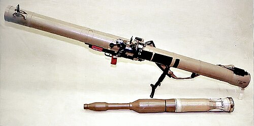

# Granatnik przeciwpancerny RPG-29 Wampir
### RPG-29 Vampir Anti-Tank Grenade Launcher | РПГ-29 «Вампир»

---

## Opis

RPG-29 Wampir (Вампир — Wampir) to rosyjski granatnik przeciwpancerny wielokrotnego użytku kalibru 105 mm opracowany przez GSKB-47 i przyjęty do służby w 1989 roku. Wyróżnia się potężną głowicą tandemową PG-29V przebijającą ponad 750 mm pancerza za ERA — co pozwala na niszczenie czołgów T-72 z pancerzem reaktywnym, T-90 i potencjalnie M1A2 Abrams od strony bocznej. Jest to jeden z najpotężniejszych przenośnych granatników przeciwpancernych na świecie. RPG-29 jest składany — lufa i komora rozkładają się, co ułatwia transport. Stosowany przez rosyjskie siły specjalne i wybranych jednostki; eksportowany do Syrii, Iranu i Hezbollahu; używany przez Hezbollah do trafienia izraelskich Merkav w 2006 roku.

## Dane techniczne

| Parametr | Wartość |
|----------|---------|
| Typ | Granatnik przeciwpancerny wielokrotnego użytku |
| Kraj produkcji | Rosja |
| Rok wprowadzenia | 1989 |
| Kaliber | 105 mm |
| Długość (złożony) | 1 000 mm |
| Długość (do strzału) | 1 850 mm |
| Masa (bez pocisku) | 11,5 kg |
| Przenikanie pancerza | >750 mm za ERA (tandem PG-29V) |
| Zasięg skuteczny | 500 m |
| Obsługa | 2 osoby |

## Charakterystyczne cechy rozpoznawcze

> Jak odróżnić RPG-29 od RPG-7 i RPG-27:

- **Składana lufa w dwóch sekcjach — rozkładana do strzału:** RPG-29 ma lufę składaną w połowie — dwie sekcje łączone przed strzałem; to kluczowa cecha wizualna; RPG-7 ma jednoczęściową lufę; widok składania RPG-29 jest charakterystyczny
- **Ogromny kaliber 105 mm — wyraźnie grubsza rura niż RPG-7:** RPG-29 ma kaliber 105 mm vs 40 mm lufy RPG-7; rura RPG-29 jest znacznie grubsza; pocisk PG-29V o kalibrze 105 mm jest ogromny i wyraźnie grubszy niż pociski RPG-7
- **Masywny, ciężki zestaw — 11,5 kg bez pocisku:** RPG-29 jest wyraźnie cięższy od RPG-7 (6,3 kg); przy przenoszeniu widać, że to ciężka broń wymagająca dwóch ludzi do sprawnej obsługi
- **Charakterystyczny tandemowy pocisk PG-29V:** głowica PG-29V ma widoczną tandemową konstrukcję — mniejsza głowica wstępna z przodu, większa główna za nią; ten "dwuczłonowy" wygląd pocisku odróżnia go od prostszych głowic RPG-7
- **Celownik optyczny z bocznym montażem jak w RPG-7:** RPG-29 ma celownik optyczny po lewej stronie komory — podobnie jak RPG-7; ale całość jest wyraźnie masywniejsza i nowocześniejsza
- **Dwie osoby do obsługi i transportu:** obsługa RPG-29 wymaga dwóch ludzi (strzelec + ładowniczy); jednorazowe (RPG-18, 22, 26) obsługuje 1 osoba; RPG-7 może obsługiwać 1 osoba, ale zwykle jest asystent; RPG-29 zawsze wymaga pary

## Ciekawostka

> W 2006 roku podczas drugiej wojny libańskiej Hezbollah użył RPG-29 do trafienia izraelskich czołgów Merkava IV — uważanych za najlepiej chronione czołgi na świecie. Trafienie od strony bocznej lub tylnej spowodowało przebicie pancerza reaktywnego i uszkodzenie wnętrza. Armia izraelska była zszokowana — i natychmiast wszczęła dochodzenie, jak broń tak nowa i rzadka trafiła do Hezbollahu. Ustalono, że Syria i Iran przekazały RPG-29 jako "prezent" dla Hezbollahu. Incydent spowodował modyfikację taktyki izraelskich czołgów i przyspieszył instalację systemów aktywnej ochrony Trophy.

