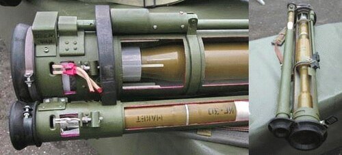

# Granatnik przeciwpancerny RPG-30 Kryuk
### RPG-30 Kryuk Anti-Tank Grenade Launcher | РПГ-30 «Крюк»

---

## Opis

RPG-30 Kryuk (Крюк — Hak) to rosyjski jednorazowy granatnik przeciwpancerny kalibru 105 mm opracowany przez GNPP Bazalt i przyjęty do służby w 2008 roku. Wyróżnia się unikalnym systemem "fałszywego pocisku" — przed głowicą główną wystrzeliwana jest mała rakieta-przynęta (kaliber 40 mm), która wyzwala systemy aktywnej ochrony czołgu (jak Shtora, Arena, Trophy); po ułamku sekundy główna głowica 105 mm trafia w cel pozbawiony już obrony aktywnej. RPG-30 jest jedyną na świecie masową bronią jednorazową zaprojektowaną specjalnie do pokonywania systemów aktywnej ochrony czołgów. Niezwykle nowoczesna koncepcja w jednorazowym, lekkim granatniki.

## Dane techniczne

| Parametr | Wartość |
|----------|---------|
| Typ | Jednorazowy granatnik z systemem neutralizacji APS |
| Kraj produkcji | Rosja |
| Rok wprowadzenia | 2008 |
| Kaliber główny | 105 mm |
| Kaliber przynęty | 40 mm |
| Długość | 1 135 mm |
| Masa | 10,3 kg |
| Przenikanie pancerza | >650 mm za ERA |
| Zasięg skuteczny | 200 m |
| Obsługa | 1 osoba |

## Charakterystyczne cechy rozpoznawcze

> Jak odróżnić RPG-30 od RPG-26, RPG-27 i RPG-29:

- **Dwie równoległe rury — duża i mała obok siebie:** RPG-30 ma charakterystyczny wygląd z DWOMA równoległymi tubusami — grubą tubą 105 mm z głównym pociskiem i cienką tubą 40 mm z pociskiem-przynętą; żaden inny granatnik nie ma dwóch równoległych rur; to natychmiastowy identyfikator RPG-30
- **Cienka dodatkowa rura po boku głównej — "przyczepka":** mała tuba 40 mm jest przymocowana z boku grubej tuby 105 mm; ten "przyczepiony" mały cylinder jest unikalny wizualnie i natychmiast zwraca uwagę
- **Jednorazowy — wyrzucany po strzale (ale ciężki):** RPG-30 waży 10,3 kg — to ciężka jednorazówka; lżejsze jednorazowe (RPG-26 — 2,9 kg, RPG-18 — 2,6 kg) są wyraźnie mniejsze i lżejsze
- **Brak składania lufy (w odróżnieniu od RPG-29):** RPG-30 jest jednorazowy i nie składa lufy; RPG-29 (wielokrotnego użytku) ma składaną lufę w dwóch sekcjach — ta różnica pomaga odróżnić oba systemy kalibrów 105 mm
- **Bardzo rzadki na polach walki — broń specjalistyczna:** RPG-30 jest kosztowny i produkowany w ograniczonych ilościach; widok tej broni sugeruje wyspecjalizowaną jednostkę lub szczególnie wyposażoną piechotę; w masowej piechoty nie jest powszechny
- **Nowoczesne, obłe kształty obudowy — "taktyczny" wygląd:** RPG-30 ma nowocześniejszy, bardziej "taktyczny" wygląd niż RPG-26 (prosta rura); obudowa jest bardziej obła i zaawansowana ergonomicznie

## Ciekawostka

> RPG-30 jest odpowiedzią na systemy aktywnej ochrony czołgów takie jak izraelski Trophy (Rafael) i rosyjski Arena. Projektanci Bazalt wpadli na genialnie prostą koncepcję: zamiast budować szybszy pocisk (trudne i drogie), wystrzel imitację (prosta i tania), aby "zużyć" system ochrony zanim trafi główna głowica. Systemy Trophy i Arena potrzebują kilku sekund na przeładowanie po neutralizacji zagrożenia — a RPG-30 nie daje im tej chwili. Zachodnie armie, kupując systemy aktywnej ochrony, musiały od razu brać pod uwagę właśnie RPG-30 jako zagrożenie, które może je ominąć.

