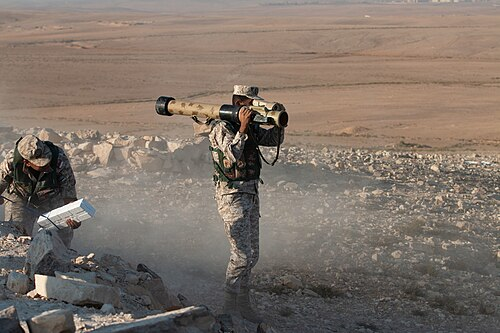

# Granatnik wielokrotnego użytku RPG-32 Hashim
### RPG-32 Hashim Multi-Shot Rocket Launcher | РПГ-32 «Хашим»

---

## Opis

RPG-32 Hashim (Хашим — arabskie imię) to rosyjsko-jordański modułowy granatnik przeciwpancerny opracowany wspólnie przez GNPP Bazalt (Rosja) i Jordan Armed Forces (Jordania) i przyjęty do służby w 2014 roku. Wyróżnia się modułowym systemem ładowania — do tej samej tuby wielokrotnego użytku można mocować różne kalibrowe głowice: 72,5 mm (przeciwpancerne i termobaryczne) oraz 105 mm (tandemowe). RPG-32 jest produkowany w Jordanii przez Jadara Weaponry w ramach umowy licencyjnej z Rosją — jest to rzadki przypadek wspólnej produkcji z arabskim krajem. Może być używany zarówno przez operatorów w kamizelce z pojemnikiem głowicy, jak i z wyrzutni montowanej na pojeździe.

## Dane techniczne

| Parametr | Wartość |
|----------|---------|
| Typ | Modułowy wielokrotnego użytku granatnik |
| Kraj produkcji | Rosja / Jordania |
| Rok wprowadzenia | 2014 |
| Kalibry głowic | 72,5 mm / 105 mm |
| Długość (tuba bez głowicy) | 900 mm |
| Masa (tuba) | 3,0 kg |
| Masa (z głowicą 105 mm) | ok. 10 kg |
| Przenikanie pancerza | >650 mm za ERA (105 mm tandem) |
| Zasięg skuteczny | 200–700 m (zależnie od głowicy) |
| Obsługa | 1–2 osoby |

## Charakterystyczne cechy rozpoznawcze

> Jak odróżnić RPG-32 od RPG-7 i RPG-29:

- **Modułowa tuba bez własnej głowicy — wymienny "pojemnik":** RPG-32 składa się z oddzielnej tuby (wyrzutni) i oddzielnych "kontenerów z głowicami"; strzelec najpierw ma samą tubę, potem przykłada głowicę; ten modułowy układ jest wizualnie unikalny — zobaczyć strzelca noszącego oddzielnie tubę i oddzielnie zasobniki głowic
- **Charakterystyczna tuba wielokrotnego użytku — bez rozszerzenia tylnego:** RPG-32 ma prostą tubę bez charakterystycznego stożkowego rozszerzenia RPG-7; proporcje są bardziej "nowoczesne" i cylindryczne
- **Głowice 72,5 mm i 105 mm wyglądają inaczej od siebie:** przy montowaniu głowicy 72,5 mm na tubę efekt jest "mniejsza głowica na dużej tubie"; przy 105 mm — "duża głowica na tubie"; ta zmienność rozmiarów jest charakterystyczna
- **Rzadkość poza Jordanią i krajami arabskimi:** RPG-32 jest eksportowany głównie przez Jordanię do krajów arabskich; w rosyjskiej armii jest mało powszechny; widok tej broni sugeruje jordańskie wojsko lub eksport na Bliski Wschód
- **Nowoczesny celownik z dodatkowym montażem optyki:** RPG-32 ma nowoczesny modułowy celownik z możliwością montażu celownika noktowizyjnego; bardziej zaawansowany wizualnie niż klasyczny celownik RPG-7
- **Tuba lżejsza od RPG-7 — 3 kg vs 6,3 kg:** tuba RPG-32 bez głowicy waży tylko 3 kg; strzelec nosi ją lekko; dopiero po dołączeniu głowicy masa rośnie do 10 kg; ta różnica w transporcie jest widoczna

## Ciekawostka

> RPG-32 jest pierwszą rosyjską bronią wyprodukowaną oficjalnie za granicą przez niebędące byłym ZSRR państwo — Jordanię. Umowa licencyjna z 2010 roku była częścią rosyjskiej strategii penetracji rynku bliskowschodniego przez wspólne projekty obronne. Jordania — tradycyjnie proamerykanin — zdecydowała się na rosyjski RPG-32 zamiast zachodnich odpowiedników z przyczyn czysto pragmatycznych: był tańszy, prostszy w obsłudze i produkowany lokalnie. Dla Rosji to sukces marketingowy: "wykonany w Jordanii" brzmi neutralnie, a wpływ rosyjskiej technologii jest oczywisty dla każdego znającego temat.

