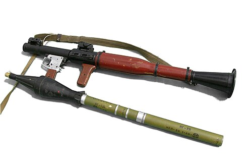

# Granatnik przeciwpancerny RPG-7
### RPG-7 Anti-Tank Grenade Launcher | РПГ-7

---

## Opis

RPG-7 to radziecki granatnik przeciwpancerny kalibru 40 mm (lufa) z naddźwiękowym pociskiem rakietowym o kalibrze 40–105 mm, opracowany przez GSKB-47 i przyjęty do służby w 1961 roku. Jest najszerzej stosowanym i produkowanym granatnikiem przeciwpancernym w historii — szacunki mówią o ponad 9 milionach egzemplarzy wyprodukownych na całym świecie. RPG-7 może używać szerokiej gamy głowic: przeciwpancerne kumulacyjne PG-7 (przebicie 500–750 mm), tandemowe PG-7VR (600 mm za ERA), termobaryczne TBG-7V, odłamkowe OG-7V i inne. Stosowany przez armie ponad 40 państw i setki organizacji zbrojnych, bojowników i milicji na całym świecie; jest symbolem uzbrojenia nieregularnego.

## Dane techniczne

| Parametr | Wartość |
|----------|---------|
| Typ | Granatnik przeciwpancerny wielokrotnego użytku |
| Kraj produkcji | ZSRR / Rosja / wiele innych |
| Rok wprowadzenia | 1961 |
| Kaliber lufy | 40 mm |
| Kaliber pocisku | 40–105 mm (zależnie od głowicy) |
| Długość | 950 mm |
| Masa (bez pocisku) | 6,3 kg |
| Zasięg skuteczny | 200 m (cel ruchomy) / 500 m (cel stały) |
| Przenikanie pancerza | do 750 mm (PG-7VL) / 600 mm za ERA (PG-7VR tandem) |
| Obsługa | 1–2 osoby |

## Charakterystyczne cechy rozpoznawcze

> Jak odróżnić RPG-7 od RPG-18/22/26 i innych granatników:

- **Wielokrotnego użytku — lufa metalowa, nie jednorazowa:** RPG-7 ma trwałą metalową lufę — nie jest jednorazowa jak RPG-18, RPG-22, RPG-26; jeśli strzelec po strzale dalej nosi granatnik — to RPG-7
- **Charakterystyczna stożkowa lufa rozszerzająca się przy wylocie:** tylna część lufy RPG-7 ma charakterystyczny rozszerzony stożek (do redukcji odrzutu gazów); ta stożkowa tylnica jest ikoniczna — natychmiast identyfikuje RPG-7
- **Duży kumulacyjny pocisk wystający z przodu lufy (przed strzałem):** przed odpaleniem pocisk PG-7 (lub inny) sterczy znacząco z przodu lufy; charakterystyczny kształt głowicy piezoelektrycznej z nosem "iglicowym" i cylindrycznym ciałem rakiety
- **Dwuetapowy napęd — widoczny ślad rakiety po odpaleniu:** RPG-7 używa wstępnego ładunku miotającego (wyrzuca pocisk z lufy) i silnika rakietowego (odpala się po ~10 m); charakterystyczny dym i ogień z tyłu przy odpaleniu, potem ślad silnika rakietowego
- **Klasyczny celownik optyczny PGO-7 z lewej strony:** granatnik RPG-7 ma charakterystyczny mały celownik optyczny zamontowany po lewej stronie lufy — to najczęstszy układ; rozpoznawalny na zdjęciach jako "mały teleskop na boku granatnika"
- **Duże, różne typy głowic — wymienne bez narzędzi:** RPG-7 może używać wielu różnych głowic widocznie różniących się kształtem i rozmiarem; PG-7 (standardowa) vs TBG-7V (termobaryczna) vs OG-7V (odłamkowa) — każda ma inną sylwetke głowicy

## Ciekawostka

> RPG-7 jest wymieniony w Księdze Rekordów Guinnessa jako broń produkowana przez największą liczbę krajów bez licencji. Prócz ZSRR i Rosji produkują go lub produkowały: Chiny (Typ 69), Egipt, Iran, Irak, Rumunia, Bułgaria, Jugosławia i co najmniej 10 innych. Ironicznie — USA przez jakiś czas rozważały przyjęcie RPG-7 na uzbrojenie sił specjalnych jako "captured enemy equipment" ze względu na jego niezawodność i powszechność amunicji. Ostatecznie zdecydowano się na M72 LAW i M3 MAAWS, ale opinia o RPG-7 jako o wyjątkowo niezawodnej broni pozostaje powszechna wśród wojskowych ekspertów zachodnich.

