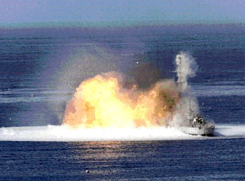

# Jednorazowy granatnik termobaryczny RShG-1
### RShG-1 Thermobaric Rocket Launcher | РШГ-1

---

## Opis

RShG-1 (Реактивная Штурмовая Граната — Reaktywny szturmowy granat) to rosyjski jednorazowy granatnik z głowicą termobaryczną kalibru 105 mm opracowany przez GNPP Bazalt i przyjęty do służby w 1999 roku. Nie jest bronią przeciwpancerną — jego głowica termobaryczna (fuel-air explosive, FAE) niszczy siłę żywą w schronach, bunkrach, budynkach i na otwartym terenie przez falę ciśnienia i wypalenie tlenu w zamkniętych przestrzeniach. Jeden strzał RShG-1 niszczy wszystkie żywe istoty w schronie o objętości do 100 m³ lub na otwartym terenie w promieniu 10 m. Stosowany masowo w Czeczenii i Syrii do "oczyszczania" budynków i podziemi.

## Dane techniczne

| Parametr | Wartość |
|----------|---------|
| Typ | Jednorazowy granatnik termobaryczny |
| Kraj produkcji | Rosja |
| Rok wprowadzenia | 1999 |
| Kaliber | 105 mm |
| Długość | 1 100 mm |
| Masa | 8,8 kg |
| Rodzaj głowicy | Termobaryczna (FAE) |
| Zasięg skuteczny | 200 m |
| Obsługa | 1–2 osoby |

## Charakterystyczne cechy rozpoznawcze

> Jak odróżnić RShG-1 od RPG-27 i RPG-7 z głowicą TBG:

- **Identyczne zewnętrznie z RPG-27 — różnica tylko w głowicy:** RShG-1 i RPG-27 mają bardzo podobne rozmiary i kształt tuby; główna różnica to kształt głowicy — RShG-1 ma charakterystyczną "tępą" głowicę termobaryczną (bez piezoelektrycznego igłowego nosa jak HEAT); ten "tępy nos" głowicy jest kluczowym wyróżnikiem wizualnym
- **Tępa, cylindryczna głowica bez piezoelektrycznego nosa:** głowice HEAT mają charakterystyczny długi "iglicowy" nos piezoelektryczny; głowice termobaryczne mają krótszy, bardziej zaokrąglony lub "tępy" nos; ta różnica kształtu głowicy pozwala odróżnić RShG-1 od RPG-27
- **Żółte lub pomarańczowe oznaczenia na głowicy i tubie:** głowice termobaryczne mają zwyczajowo żółte (lub pomarańczowe) oznaczenia kolorem — standard rosyjski dla broni termobarycznej; HEAT ma czerwone lub beżowe oznaczenia; kolor etykiet jest sygnałem
- **Brak właściwości przeciwpancernych — inne zastosowanie taktyczne:** RShG-1 nie jest używany do strzelania do czołgów; widok żołnierza używającego go przy szturmie budynku (nie przy pojeździe) sugeruje termobaryczny charakter
- **Masa 8,8 kg — porównywalna z RPG-27 (8 kg):** podobna masa do RPG-27; wyraźnie cięższy od jednorazówek 72,5 mm (RPG-26 — 2,9 kg); ta masa jest charakterystyczna dla "ciężkich jednorazówek 105 mm"
- **Wersja lżejsza — RShG-2 (72,5 mm):** istnieje też lżejsza wersja RShG-2 kalibru 72,5 mm (~3,8 kg); odróżnienie od RShG-1 po kalibrze tuby (cieńsza rura) i mniejszych rozmiarach całości

## Ciekawostka

> RShG-1 był masowo stosowany przez rosyjskie siły w Czeczenii — podczas walk w Groznym w 1999–2000 roku żołnierze opisywali go jako "narzędzie do oczyszczania piwnic i klatek schodowych". Jedna głowica termobaryczna w przestrzeni zamkniętej eliminuje siłę żywą bez konieczności wejścia do środka i ręcznej walki. Czeczeńscy bojownicy doświadczyli tego jako szczególnie przerażającej broni — bo nie było ochrony przed falą ciśnienia i temperaturą w zamkniętych schronach. Human Rights Watch udokumentowało użycie RShG-1 w Syrii i Czeczenii, podnosząc kwestię proporcjonalności w terenach zamieszkanych.

