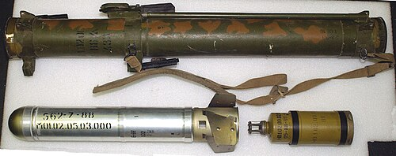

# Wyrzutnia termobaryczna RPO-A Szmiel
### RPO-A Shmel Thermobaric Launcher | РПО-А «Шмель»

---

## Opis

RPO-A Szmiel (Шмель — Trzmiel) to radziecko-rosyjski jednorazowy granatnik termobaryczny kalibru 93 mm opracowany przez GNPP Bazalt i przyjęty do służby w 1988 roku. Szmiel nie jest bronią przeciwpancerną — to "ogniotna" broń piechoty do rażenia celów żywych w budynkach, schronach, pojazdach opancerzonych (lekkich) i umocnień polowych przez efekt termobaryczny. Głowica RPO-A detonuje w środku celu, wytwarzając temperaturę ponad 800°C i falę ciśnienia niszczącą wszystko w promieniu 5 m (schrony zamknięte — 80 m³). Jest uważany za najskuteczniejszą przenośną broń termobaryczną na świecie i był masowo stosowany w Afganistanie, Czeczenii, Syrii i Ukrainie.

## Dane techniczne

| Parametr | Wartość |
|----------|---------|
| Typ | Jednorazowy granatnik termobaryczny |
| Kraj produkcji | ZSRR / Rosja |
| Rok wprowadzenia | 1988 |
| Kaliber | 93 mm |
| Długość | 920 mm |
| Masa | 11,0 kg |
| Rodzaj głowicy | Termobaryczna (FAE) |
| Zasięg skuteczny | 200 m (schrony) / 600 m (tereny otwarte) |
| Obsługa | 1–2 osoby |

## Charakterystyczne cechy rozpoznawcze

> Jak odróżnić RPO-A Szmiel od RShG-1 i lekkich granatników:

- **Szarawozielona lub ciemnozielona metalowa tuba — inny kolor niż RPG:** Szmiel ma charakterystyczny metalowy tubę w kolorze ciemnozielonym lub oliwkowym — bardziej "artyleryjskim" niż czarne lub szare tuby RPG-26/27; ten kolor jest pierwszą wskazówką
- **Masywna, okrągła tuba bez rozszerzenia tylnego:** Szmiel ma prostą, jednoczęściową cylindryczną tubę bez stożkowego rozszerzenia z tyłu (charakterystycznego dla RPG-7); proporcje są "kanciaste" i militarnie proste
- **Ciężki — 11 kg — wyraźnie czuje się ciężar:** Szmiel waży 11 kg — to dużo dla jednorazowej broni; strzelec nosi go na ramieniu lub trzyma dwoma rękami; wyraźna różnica w ciężarze od lekkich jednorazówek (RPG-18 — 2,6 kg)
- **Charakterystyczne pomarańczowe lub żółte oznaczenia na tubie:** termobaryczne głowice Szmiela mają żółte lub pomarańczowe markings na tubie — standardowe rosyjskie oznaczenia dla broni termobarycznej; inne niż oznaczenia broni HEAT
- **Brak głowicy piezoelektrycznej z nosem "iglicą":** Szmiel ma zaokrągloną, tępą głowicę bez długiego nosa; w odróżnieniu od HEAT RPG-7 widać wyraźnie, że nos jest krótki i zaokrąglony — "tuba do przenoszenia"
- **Na ramieniu — charakterystyczna pozycja strzelecka:** Szmiel strzela się z ramienia; charakterystyczna pozycja strzelca z ogromną tubą na ramieniu jest podobna do RPG-7, ale Szmiel jest grubszy i bardziej "ciężki" wizualnie

## Ciekawostka

> Szmiel zyskał przydomek "piechotna artyleria" w Afganistanie, gdzie radzieccy żołnierze używali go do "przepłoszania" mudżahedinów z jaskiń i tuneli — gdzie inaczej musiałaby wejść piechota w samobójczych szturmach. Jedna głowica Szmiela w tunelu eliminowała wszystkich wewnątrz bez konieczności kontaktu bezpośredniego. Afgańczycy bali się Szmiela bardziej niż wielu innych broni rosyjskich — po jego użyciu nawet "bezpieczne" schrony przestały być bezpieczne. W Czeczenii Szmiel pojawił się po obu stronach — część egzemplarzy zdobyli czeczeńscy bojownicy i używali ich w walkach miejskich w Groznym.

