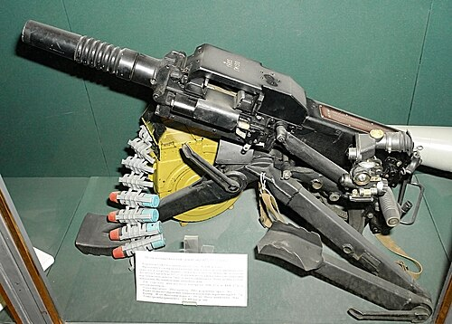

# Automatyczny granatnik AGS-17 Płamia
### AGS-17 Plamya Automatic Grenade Launcher | АГС-17 «Пламя»

---

## Opis

AGS-17 Płamia (Пламя — Płomień) to radziecki automatyczny granatnik stanowiskowy kalibru 30 mm opracowany przez KBP w Tule i przyjęty do służby w 1971 roku. Strzela seryjnie granatami odłamkowo-burzącymi VOG-17M na odległość do 1730 m — zapewniając nasycenie obszaru odłamkami jak moździerz, ale z szybkostrzelnością automatyczną (50–65 strzałów/min). AGS-17 jest montowany na trójnodze naziemnym, BWP (BMP-2), śmigłowcach (Mi-24) i łodziach bojowych. Obsługa 3-osobowa może przenosić rozkładany zestaw na plecach. Szeroko stosowany w Afganistanie, Czeczenii, Syrii i na Ukrainie — jest standardową bronią wsparcia szczebla kompania w armii rosyjskiej.

## Dane techniczne

| Parametr | Wartość |
|----------|---------|
| Typ | Automatyczny granatnik stanowiskowy |
| Kraj produkcji | ZSRR / Rosja |
| Rok wprowadzenia | 1971 |
| Kaliber | 30×29 mm |
| Długość (bez trójnogu) | 840 mm |
| Masa (z trójnogiem i bębnem) | 31 kg |
| Zasięg maks. | 1 730 m |
| Szybkostrzelność | 50–65 strz./min |
| Pojemność zasobnika | 29 nabojów (bęben) |
| Obsługa | 3 osoby |

## Charakterystyczne cechy rozpoznawcze

> Jak odróżnić AGS-17 od AGS-30 i granatników Mk 19:

- **Charakterystyczny okrągły bębnowy zasobnik nabojowy z lewej strony:** AGS-17 ma charakterystyczny okrągły metalowy bęben z nabojami (29 sztuk) przymocowany po lewej stronie broni; ten okrągły zasobnik jest natychmiastowym identyfikatorem — żadna inna broń nie ma tak widocznego okrągłego bębna z boku
- **Prostokątna skrzynkowa komora zamkowa — "pudełkowaty" wygląd:** AGS-17 ma charakterystyczny "pudełkowy" kształt komory zamkowej i korpusu; przypomina bardziej maszynę przemysłową niż typowy karabin; ten geometryczny, kanciasty wygląd odróżnia go od lżejszego AGS-30
- **Trójnóg z regulacją wysokości — stalowe nogi o "pajęczym" układzie:** trójnóg AGS-17 ma charakterystyczne trzy grube stalowe nogi z regulacją; całość jest masywna i wyraźnie "wojskowa"; podobnie do trójnogu DShK, ale mniejszy
- **Masywny, ciężki zestaw — 31 kg całości:** AGS-17 z trójnogiem i zasobnikiem waży 31 kg; AGS-30 jest lżejszy (16 kg); przy transporcie widać ciężar zestawu — 3 osoby niosą go w częściach
- **Montaż na BWP i śmigłowcach — widoczna na pojazdach:** AGS-17 na wieżyczce BWP lub pod dziobem Mi-24 to rozpoznawalny widok; mały, kanciasty granatnik ze swoim bębnem jest charakterystycznym wyposażeniem tych platform
- **Linia ognia prawie pozioma — nie jak moździerz, nie jak karabin:** AGS-17 strzela pod małym kątem elevacji (jak karabin), a nie bardzo stromo (jak moździerz); żołnierz "celuje" jak z karabinu maszynowego, nie jak z moździerza

## Ciekawostka

> AGS-17 zyskał sławę w Afganistanie, gdzie radzieccy żołnierze montowali go na dachach budynków i ścianach okopów zamiast na trójnogu — "pionowy" AGS-17 strzelał jak moździerz, rażąc cele za wzniesieniami terenu. Ten pomysłowy sposób użycia nie był przewidziany przez projektantów, ale okazał się bardzo skuteczny w górach, gdzie tradycyjne "płaskie" strzelanie granatamiutrudniała rzeźba terenu. Afgańscy mudżahedini zdobywali AGS-17 i przechowywali je jako cenne łupy — bo granat VOG-17M eksploduje nawet przy kontakcie z cienką gałązką drzewa.

