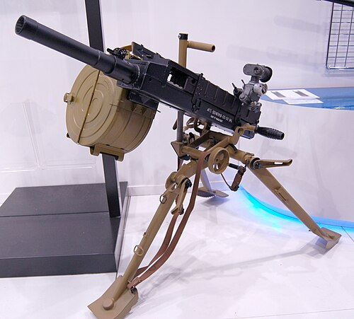

# Automatyczny granatnik AGS-30
### AGS-30 Automatic Grenade Launcher | АГС-30

---

## Opis

AGS-30 to rosyjski automatyczny granatnik stanowiskowy kalibru 30 mm opracowany przez KBP w Tule jako lżejszy następnik AGS-17 i przyjęty do służby w 1995 roku. Wyróżnia się masą o połowę mniejszą niż AGS-17 — 16 kg całości vs 31 kg — co pozwala na przeniesienie zestawu przez dwie osoby zamiast trzech. Używa ulepszonej amunicji VOG-30 (w tym VOG-30P z zapalnikiem zdalnym) i ma wyższy zasięg niż AGS-17. AGS-30 jest coraz szerzej stosowany jako uzupełnienie i następca AGS-17 w armii rosyjskiej; pojawia się na Ukrainie jako przenośna broń wsparcia piechoty i na pojazdach.

## Dane techniczne

| Parametr | Wartość |
|----------|---------|
| Typ | Automatyczny granatnik stanowiskowy |
| Kraj produkcji | Rosja |
| Rok wprowadzenia | 1995 |
| Kaliber | 30×29 mm |
| Długość | 825 mm |
| Masa (z trójnogiem) | 16 kg |
| Zasięg maks. | 1 700 m |
| Szybkostrzelność | 400 strz./min (max) / 60 strz./min (bojowy) |
| Pojemność taśmy | 30 nabojów |
| Obsługa | 2 osoby |

## Charakterystyczne cechy rozpoznawcze

> Jak odróżnić AGS-30 od AGS-17:

- **Wyraźnie mniejszy i lżejszy od AGS-17 — 16 kg vs 31 kg:** AGS-30 jest niemal o połowę lżejszy; przy porównaniu sylwetek na zdjęciach AGS-30 jest smuklejszy i "mniejszy"; trójnóg jest też lżejszy i cieńszy
- **Taśmowe podawanie amunicji zamiast bębna:** AGS-30 ma zasilanie taśmowe (kaseta z taśmą) zamiast okrągłego bębna AGS-17; brak charakterystycznego okrągłego zasobnika po lewej jest kluczowym wyróżnikiem; zamiast bębna widoczna jest kaseta z taśmą
- **Bardziej opływowy, nowocześniejszy wygląd komory zamkowej:** AGS-30 ma nowocześniejszy, mniej "pudełkowaty" kształt niż AGS-17; sylwetka jest bardziej opływowa i nowoczesna
- **Cieńsze nogi trójnogu i lżejszy montaż:** trójnóg AGS-30 jest wyraźnie cieńszy i lżejszy od masywnego trójnogu AGS-17; cała platforma sprawia wrażenie "nowocześ­niejszej" i "lekkości"
- **Obsługa 2-osobowa zamiast 3-osobowej:** AGS-30 obsługują 2 osoby; AGS-17 — 3; przy obserwacji pracy obsługi różnica w liczbie ludzi to sygnał
- **Kaseta taśmowa z boku — inny układ zasilania niż AGS-17:** przy AGS-30 widoczna jest kaseta z taśmą (mniej widowiskowy niż okrągły bęben); ta różnica układu podajnika jest kluczowa

## Ciekawostka

> AGS-30 projektowano z założeniem, że żołnierz będzie go przenosić sam lub we dwójkę bez pojazdu. W testach jeden wytrenowany żołnierz mógł dźwigać cały AGS-30 rozkładany w plecaku — czego nigdy nie osiągnięto z AGS-17. W Syrii rosyjscy doradcy wojskowi wyposażali syryjskie jednostki specjalne w AGS-30 jako "mobilne wsparcie ogniowe" w miastach — cięższy AGS-17 był za mało manewrowy do walk ulicznych. Lżejszy AGS-30 okazał się idealny do szybkich zasadzek: rozłożenie, seria i odejście przed kontratakiem.

