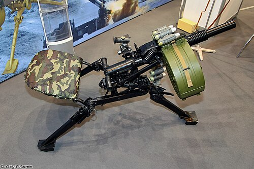

# Automatyczny granatnik AGS-40 Bałkan
### AGS-40 Balkan Automatic Grenade Launcher | АГС-40 «Балкан»

---

## Opis

AGS-40 Bałkan (Балкан) to rosyjski automatyczny granatnik stanowiskowy kalibru 40 mm opracowany przez KBP w Tule i przyjęty do służby ok. 2018 roku jako broń nowej generacji dla programu "Ratnik-3". Wyróżnia się kaliber 40 mm (większy niż 30 mm AGS-17/30) z nową amunicją ZOF-40 o znacznie większej masie głowicy i zasięgu do 2500 m. Nowa amunicja Z-40 ma możliwość programowania zapalnika "na odległość" (airburst) — granat wybucha w powietrzu nad okopem lub za zasłoną. AGS-40 jest cięższy od AGS-30, ale daje znacznie większą siłę rażenia. Trwa doposażanie wybranych jednostek.

## Dane techniczne

| Parametr | Wartość |
|----------|---------|
| Typ | Automatyczny granatnik stanowiskowy nowej generacji |
| Kraj produkcji | Rosja |
| Rok wprowadzenia | ok. 2018 |
| Kaliber | 40×53 mm |
| Masa (z trójnogiem) | ~32 kg |
| Zasięg maks. | 2 500 m |
| Szybkostrzelność | 400 strz./min (max) / 60–100 strz./min (bojowy) |
| Obsługa | 2–3 osoby |

## Charakterystyczne cechy rozpoznawcze

> Jak odróżnić AGS-40 od AGS-17 i AGS-30:

- **Wyraźnie grubsza rura lufy 40 mm — kaliber 40 vs 30 mm widoczny:** lufa AGS-40 ma kaliber 40 mm — wyraźnie grubsza niż lufa AGS-17/30 (30 mm); przy porównaniu obu broni grubość lufy od razu odróżnia AGS-40
- **Nowoczesny wygląd — kanciasty, taktyczny design z szynami:** AGS-40 ma nowoczesny wygląd z szynami Picatinny i ergonomicznym łożem — bardziej "taktyczny" niż "wojskowy retro" AGS-17; wyraźna różnica w stylistyce
- **Brak okrągłego bębna — taśmowe podawanie:** AGS-40 (jak AGS-30) ma taśmowe zasilanie bez charakterystycznego okrągłego bębna AGS-17; kaseta z taśmą z boku
- **Rzadkość na polu walki — nowa broń z ograniczoną produkcją:** AGS-40 jest nowym systemem i pojawia się rzadko; jego widok sugeruje jednostkę wyposażoną w sprzęt "Ratnik-3"; powszechniejszy AGS-17 i AGS-30 są na starszych formacjach
- **Cięższy od AGS-30 — ok. 32 kg (podobny do AGS-17):** AGS-40 waży więcej niż AGS-30; masa jest bliższa AGS-17; to "powrót" do ciężkiej platformy po lżejszym AGS-30 — za cenę większej siły rażenia
- **Programowalny zapalnik — widoczny dodatkowy element elektroniczny przy lufie:** wersje z programowalnym zapalnikiem airburst mają dodatkowy moduł elektroniczny przy wyjściu lufy lub komoże — charakterystyczny "kwadratowy element" nieobecny w AGS-17/30

## Ciekawostka

> AGS-40 Bałkan jest pierwszym rosyjskim automatycznym granatnikiem stanowiskowym zdolnym do strzelania pociskami airburst — granaty eksplodują w zaprogramowanej odległości w powietrzu, rażąc cel "z góry" odłamkami. Ta technika szczególnie skutecznie niszczy siłę żywą w okopach i za osłonami, gdzie tradycyjne granaty wybuchające przy trafieniu są mniej efektywne. Zachodnie odpowiedniki (Mk 47 Striker) mają tę samą funkcję od lat, ale AGS-40 jest pierwszym rosyjskim granatnikiem z tą zdolnością — demonstrując, że Rosja nadrabia zaległości technologiczne w tej dziedzinie.

