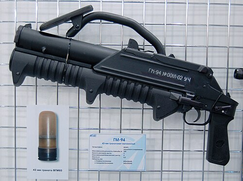

# Rewolwerowy granatnik GM-94
### GM-94 Pump-Action Grenade Launcher | ГМ-94

---

## Opis

GM-94 to rosyjski rewolwerowy granatnik pompowy (pump-action) kalibru 43 mm opracowany przez KBP w Tule i przyjęty do służby w 1994 roku dla FSB, jednostek antyterrorystycznych i sił specjalnych. Wyróżnia się kompaktową budową i bębnowym magazynkiem na 3 naboje — może strzelać różnymi typami amunicji: termobaryczną (OD-43), chemiczną (drażniąca), dymną, gumową (nieśmiertelna) i odłamkową. Ruch pompowy "przerucza" nabój i gotuje broń do strzału — podobnie jak shotgun. GM-94 jest przeznaczony do walki w budynkach i tunelach na bliskie odległości (do 300 m) — nie do strzelania artyleryjskiego. Uważany za jedno z najlepszych narzędzi antyterrorystycznych na świecie.

## Dane techniczne

| Parametr | Wartość |
|----------|---------|
| Typ | Rewolwerowy granatnik pump-action |
| Kraj produkcji | Rosja |
| Rok wprowadzenia | 1994 |
| Kaliber | 43 mm |
| Długość | 810 mm |
| Masa (bez nabojów) | 4,8 kg |
| Pojemność | 3 naboje (bęben) + 1 w komorze |
| Zasięg maks. | 300 m |
| Szybkostrzelność | 6–8 strz./min (pump-action) |
| Obsługa | 1 osoba |

## Charakterystyczne cechy rozpoznawcze

> Jak odróżnić GM-94 od GP-25/30 i AGS-17:

- **Autonomiczna broń strzelecka — nie nasadkowy granatnik:** GM-94 to samodzielna broń, nie montowana pod lufą karabinu; ma własną kolbę, spust i chwyt — wygląda jak duży shotgun, nie jak nasadkowa wyrzutnia; to fundamentalna różnica od GP-25/30
- **Bęben na 3 naboje widoczny pod rurą magazynkową:** GM-94 ma charakterystyczny okrągły magazynek-bęben z 3 nabojami widoczny pod rurą; ruch pompowy (przesunięcie cześć przedniej ku tyłowi) powoduje obrót bębna i załadowanie kolejnego naboju
- **Kaliber 43 mm — unikalny, niespotykany w innych rosyjskich granatnikach:** kaliber 43 mm jest charakterystyczny tylko dla GM-94; GP-25/30/34 mają 40 mm; AGS-17/30 mają 30 mm; niezwykły kaliber 43 mm identyfikuje GM-94 jednoznacznie
- **Wygląd "pompowego strzelby" — nie karabinu ani stanowiskowej broni:** GM-94 wygląda jak grubszy shotgun z pumpa; żadna inna rosyjska broń nie ma tak "cywilnego" lub "policyjnego" wyglądu — GM-94 nie wygląda jak wojskowy granatnik
- **Kompaktowy i stosowany przez policję oraz antyterrorystów:** GM-94 pojawia się głównie na fotografiach FSB, OMON i rosyjskich jednostek antyterrorystycznych — nie na regularnych żołnierzach piechoty; sam kontekst użycia sugeruje tę broń
- **Różnorodna amunicja — widoczne różne kolory głowic nabojów:** naboje GM-94 mają różne kolory w zależności od przeznaczenia (termobaryczny, gumowy, dymny) — przy obserwacji obsługi strzelec dobiera "kolor naboju" odpowiedni do sytuacji; ten dobór amunicji jest charakterystyczny dla broni wielozadaniowej

## Ciekawostka

> GM-94 był jednym z narzędzi używanych przez FSB podczas szturmu na teatr na Dubrowce w 2002 roku (zakładnicy Nord-Ost). Według niepotwierdzonych raportów, GM-94 z amunicją chemiczną (środek powodujący chwilowy paraliż) był testowany w scenariuszach szturmu budynku — jako sposób na obezwładnienie terrorystów bez zabijania zakładników. Skuteczność w tamtym konkretnym zdarzeniu jest dyskutowana, bo większość ofiar zakładniczych zginęła od środka znieczulającego przez wentylację, nie od bezpośredniego działania broni.

