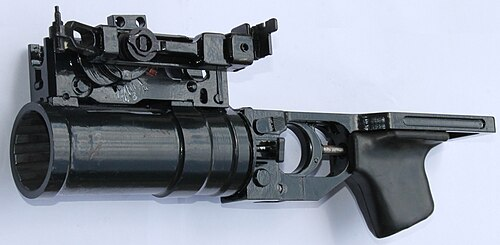

# Nasadkowy granatnik GP-25 Kostior
### GP-25 Koster Underbarrel Grenade Launcher | ГП-25 «Костёр»

---

## Opis

GP-25 Kostior (Костёр — Ognisko) to radziecki nasadkowy granatnik podlufy kalibru 40 mm opracowany przez KBP w Tule i przyjęty do służby w 1978 roku. Montowany pod lufą karabinu szturmowego AK (AKM, AK-74, AK-74M) bez demontażu broni bazowej — zamocowany na klamrze pod lufą. GP-25 pozwala żołnierzowi z karabinem szturmowym na rażenie celów ukrytych za osłonami (za rogiem, w okopach) na odległość do 400 m granatami odłamkowymi VOG-25 lub profilaktycznymi (hukowym, dymnym). Charakterystyczna właściwość: nabój 40×46 mm jest wkładany od przodu (muzzle-loading), co upraszcza konstrukcję. GP-25 jest standardowym wyposażeniem wielu armii postsowieckich i eksportowym.

## Dane techniczne

| Parametr | Wartość |
|----------|---------|
| Typ | Nasadkowy granatnik podlufy |
| Kraj produkcji | ZSRR / Rosja |
| Rok wprowadzenia | 1978 |
| Kaliber | 40 mm |
| Długość | 323 mm |
| Masa (bez amunicji) | 1,5 kg |
| Zasięg maks. | 400 m |
| Prędkość wylotowa | 76 m/s |
| Szybkostrzelność | 4–5 strz./min |
| Obsługa | 1 osoba |

## Charakterystyczne cechy rozpoznawcze

> Jak odróżnić GP-25 od GP-30 i granatników M203/AG36:

- **Ładowanie od przodu lufy (muzzle-loading) — widoczna czynność ładowania:** GP-25 jest ładowany od przodu — nabój wkładany jest do lufy od wylotu; ta czynność jest charakterystyczna i różni go od zachodniej broni (M203 — ładowanie od tyłu przez odsuwane łoże)
- **Brak spustu z przodu — spust umieszczony z tyłu granatnika:** spust GP-25 jest z tyłu granatnika (przy kolbie karabinu), nie z przodu jak w M203; ta pozycja spustu jest charakterystyczna dla rosyjskiej rodziny GP
- **Charakterystyczna cylindryczna lufa z krótką "rączką" od spodu:** GP-25 ma prostą cylindryczną lufę z krótką rączką chwytową od spodu przy spuście; wygląd jest prosty i funkcjonalny — mniej ergonomiczny niż zachodnie odpowiedniki
- **Montaż klamrowy na AK — widoczna klamra pod lufą karabinu:** GP-25 montuje się na standardowym AK przez klamrę podlufową; charakterystyczna czarna cylindryczna rura pod i nieco przed uchwytem karabinu; proporcje zestaw "AK + GP-25" są charakterystyczne
- **Brak celownika optycznego — prosty mechaniczny celownik po lewej:** GP-25 ma mały mechaniczny przyrząd celowniczy po lewej stronie; żadnej optyki; prosta "drabinkowa" skala odległości
- **Krótszy i smuklejszy od zachodniego M203:** GP-25 jest lżejszy (1,5 kg) i prostszy od M203; przy porównaniu wygląda jak "uproszczona" wersja zachodniego podlufy; sylwetka jest "bardziej ciasna" pod lufą AK

## Ciekawostka

> GP-25 był jedną z pierwszych sowieckich broni indywidualnych, które zachodnie wywiady sklasyfikowały jako "asymetryczne zagrożenie" — bo żołnierz z AK + GP-25 był de facto "drużyną wsparcia w jednym człowieku". Przed GP-25 granaty rzucano ręcznie (zasięg 30–40 m) lub używano osobnej wyrzutni granatów (niesprawny logistycznie). GP-25 dał każdemu żołnierzowi piechoty możliwość rażenia celów za osłonami na 400 m — co w taktyce piechoty jest rewolucją. NATO odpowiedziało popularyzacją M203 na M16 — ale GP-25 był lżejszy i prostszy.

